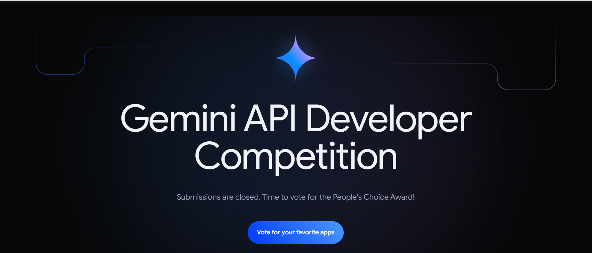

# Awesome Gemini Apps

## ¿Qué es este repositorio?

Este repositorio presenta una colección curada de casi todos los proyectos enviados al concurso de la API de Google Gemini (más de 2800 proyectos). Cada entrada de proyecto incluye:

- **Nombre del Proyecto**
- **Subtítulo** (descripción breve)
- **Enlace de YouTube** (video de demostración, si está disponible)
- **Qué hace** (descripción detallada del proyecto)
- **Desarrollado por** (nombre del desarrollador o equipo)
- **Ubicación** (origen del desarrollador/equipo)
- **Enlace del Proyecto** (enlace original de envío del proyecto)

Explora estos inspiradores proyectos y descubre el pleno potencial de la API de Google Gemini.

**Nota:** En este README, proporcionamos una selección de proyectos. Para la lista completa de proyectos (más de 2800) y su información detallada, consulta el archivo `projects_data.csv` disponible en el repositorio.

**Nota para colaboradores:** Si eres el creador de alguna de las aplicaciones listadas aquí, no dudes en hacer una contribución a este repositorio para incluir tu cuenta de GitHub y recibir el crédito correspondiente.

| **Nombre del Proyecto**                                                                                 | **Descripción**                                                                                                                                                                                | **Por y Ubicación**         | **Enlace**                                 |
|--------------------------------------------------------------------------------------------------|------------------------------------------------------------------------------------------------------------------------------------------------------------------------------------------------|-----------------------------|------------------------------------------|
| [1PUL](https://www.youtube.com/watch?v=dvV03UxqIOk)                                               | Una aplicación Flutter que rastrea artículos usando el movimiento de la cámara y almacena información de inventario en Google Sheets.                                                                                               | Brian Herbert, United States | [Link](https://ai.google.dev/competition/projects/1pul) |
| [3D Plant Facility Simulator](https://www.youtube.com/watch?v=xFMl0bGCGFs)                        | Un simulador 3D educativo que utiliza chatbots de IA para enseñar sobre instalaciones de plantas.                                                                                                                  | أœbung, Brazil                | [Link](https://ai.google.dev/competition/projects/3d-plant-facility-simulator) |
| [3daiewer](https://www.youtube.com/watch?v=VFAc3MZfvYU)                                           | Un visor de archivos 3D que permite a los usuarios consultar modelos usando la API de Gemini para obtener información de IA.                                                                                                        | Ali, Pakistan                | [Link](https://ai.google.dev/competition/projects/3daiewer) |
| [4Habits](https://www.youtube.com/watch?v=oe2L_BHnHRY)                                            | Un registro de hábitos personalizado que sugiere mejoras basadas en datos de salud usando IA.                                                                                                          | 4Habits, Italy               | [Link](https://ai.google.dev/competition/projects/4habits) |
| [5min](https://www.youtube.com/watch?v=lCmWBuD0xYQ)                                               | Una aplicación donde los usuarios dedican 5 minutos al día a discutir ideas personales con IA.                                                                                                                  | 5min, United States          | [Link](https://ai.google.dev/competition/projects/5min) |
| [A Mommy](https://www.youtube.com/watch?v=SCbaHA_2Evk)                                            | Una asistente virtual de mamá que establece alarmas, sigue horarios y recuerda hábitos usando la API de Gemini.                                                                                            | Yoppy, South Korea           | [Link](https://ai.google.dev/competition/projects/a-mommy) |
| [A.I. E-Justice](https://www.youtube.com/watch?v=G-bCYoU8ySs)                                     | Una aplicación móvil que simplifica la información legal para los usuarios usando IA.                                                                                                                              | The RS, India                | [Link](https://ai.google.dev/competition/projects/ai-e-justice) |
| [Aarchid](https://www.youtube.com/watch?v=JRoQtHEF_oY)                                            | Un sistema de monitoreo de plantas que ayuda a los jardineros a cuidar las plantas con IA.                                                                                                                         | TreeTroopers, India          | [Link](https://ai.google.dev/competition/projects/aarchid) |
| [AAVA](https://www.youtube.com/watch?v=4pAGU9YhkKI)                                               | Un asistente virtual de IA diseñado para apoyar a los embajadores de ADEIN automatizando tareas y agilizando la comunicación.                                                                                | Savannaspace, Kenya          | [Link](https://ai.google.dev/competition/projects/aava) |
| [AB Insta Caption Generator](https://www.youtube.com/watch?v=2WiO9nHJC-c)                         | Una aplicación que genera pies de foto para Instagram con IA para las fotos de los usuarios.                                                                                                                          | Team Astra, India            | [Link](https://ai.google.dev/competition/projects/ab-insta-caption-generator) |
| [3Lines](https://www.youtube.com/watch?v=QGz3-Ll7oqc)                                             | Una aplicación que genera resúmenes de 3 líneas de artículos técnicos usando la API de Gemini.                                                                                                              | Miyasic, Japan               | [Link](https://ai.google.dev/competition/projects/3lines) |
| [A conversation with Bill Gates](https://www.youtube.com/watch?v=aOzRpg7ueEo)                     | Un chatbot que simula conversaciones con Bill Gates, cubriendo diversos temas globales.                                                                                                             | Infoedifice_Lee, South Korea | [Link](https://ai.google.dev/competition/projects/a-conversation-with-bill-gates) |
| [A10fy](https://www.youtube.com/watch?v=9L8HOfUlde4)                                              | Una extensión de Chrome para tareas con IA y ejecución de código directamente en páginas web usando modelos de Gemini.                                                                                           | Alex Dainiak, Armenia        | [Link](https://ai.google.dev/competition/projects/a10fy) |
| [AAVA](https://www.youtube.com/watch?v=4pAGU9YhkKI)                                               | Una aplicación de asistente virtual que apoya a organizaciones sin fines de lucro con comunicación en tiempo real y automatización de tareas a través de la API de Gemini.                                                                                 | Savannaspace, Kenya          | [Link](https://ai.google.dev/competition/projects/aava) |
| [A10fy](https://www.youtube.com/watch?v=9L8HOfUlde4)                                              | Una extensión de navegador para análisis de código IA en tiempo real y gestión de tareas usando modelos de Gemini.                                                                                                     | Alex Dainiak, Armenia        | [Link](https://ai.google.dev/competition/projects/a10fy) |
| [A conversation with Bill Gates](https://www.youtube.com/watch?v=aOzRpg7ueEo)                     | Un chatbot con IA que simula a Bill Gates, brindando consejos valiosos en diversos temas.                                                                                                  | Infoedifice_Lee, South Korea | [Link](https://ai.google.dev/competition/projects/a-conversation-with-bill-gates) |
| [4Habits](https://www.youtube.com/watch?v=oe2L_BHnHRY)                                            | Un registro de hábitos que usa IA para proporcionar consejos de salud personalizados y actualizaciones de progreso.                                                                                                              | 4Habits, Italy               | [Link](https://ai.google.dev/competition/projects/4habits) |Aquí está el formato de tabla que solicitaste 
| [AI Image Detector](https://www.youtube.com/watch?v=1A08Lt_Xd-c)             | Detecta imágenes generadas por IA usando análisis de imágenes avanzado.                                                                                      | Debabrata Bepari, India              | [Link](https://ai.google.dev/competition/projects/ai-image-detector)              |
| [AI Image Prompting Solution](https://www.youtube.com/watch?v=E38_xNLjR6U)  | Genera y mejora indicaciones de imágenes con IA con parámetros personalizables.                                                                           | Radhesyam Biswas, India              | [Link](https://ai.google.dev/competition/projects/ai-image-prompting-solution)    |
| [AI Journal Assistant](https://www.youtube.com/watch?v=5E9Wsvfx4aU)         | Crea una autobiografía impulsada por IA basada en el diario diario.                                                                                   | pillsbee, India                      | [Link](https://ai.google.dev/competition/projects/ai-journal-assistant)           |
| [AI Kit Brak](https://www.youtube.com/watch?v=iy1SA0IWfno)                  | Simplifica las ventas para pequeñas empresas usando IA para identificación de productos e integración de chatbots.                                               | BWeird, Cambodia                     | [Link](https://ai.google.dev/competition/projects/ai-kit-brak)                    |
| [AI Learning Platform - Genius](https://www.youtube.com/watch?v=ZlKc7SBTcbg) | Tutor de IA que resuelve problemas a partir de imágenes, ofreciendo soluciones paso a paso para estudiantes.                                                              | DeepMaze, United States              | [Link](https://ai.google.dev/competition/projects/ai-learning-platform-genius)    |
| [AI Legal Assistant](https://www.youtube.com/watch?v=aeEN7U3hk2Y)           | Redacta cartas legales formales eficientemente con integración de la API de Gemini.                                                                            | ts, Poland                           | [Link](https://ai.google.dev/competition/projects/ai-legal-assistant)             |
| [AI Lyrics Checker](https://www.youtube.com/watch?v=66SSq54Utgc)            | Extensión de Chrome que verifica letras de canciones por contenido explícito usando la API de Gemini.                                                                   | Taylor English, United States        | [Link](https://ai.google.dev/competition/projects/ai-lyrics-checker)              |
| [AI Mentor](https://www.youtube.com/watch?v=v1AzV_NUgbU)                    | Crea experiencias de e-learning personalizadas usando la API de Gemini para generación de contenido y recomendaciones.                                         | AI Mentor, India                     | [Link](https://ai.google.dev/competition/projects/ai-mentor)                     |
| [AI Personal Shopper](https://www.youtube.com/watch?v=0OIG23Tr9yc)          | Asiste con compras de ropa proporcionando críticas de moda personalizadas.                                                                      | GaryZ, United States                 | [Link](https://ai.google.dev/competition/projects/ai-personal-shopper)            |
| [AI Personalized Learning](https://www.youtube.com/watch?v=NqZJscyHhT0)     | Usa IA para crear currículos y lecciones personalizadas para el aprendizaje continuo.                                                                      | -, Türkiye                             | [Link](https://ai.google.dev/competition/projects/ai-personalized-learning)       |
| [AI Playground](https://www.youtube.com/watch?v=A24KG36sfW4)                | Un juego que usa IA para generar indicaciones creativas e identificar imágenes dibujadas por el usuario.                                                                 | Creative Krish, India                | [Link](https://ai.google.dev/competition/projects/ai-playground)                 |
| [AI Poem Generator](https://www.youtube.com/watch?v=33fqETTmzzo)            | Ayuda a los poetas a generar ideas y poemas usando la API de Gemini.                                                                                       | Androi Dato, Egypt                   | [Link](https://ai.google.dev/competition/projects/ai-poem-generator)             |
| [AI Post](https://www.youtube.com/watch?v=cQky1JDhQIo)                      | Genera publicaciones para redes sociales basadas en documentos e imágenes cargados por el usuario.                                                                        | Yuki Shiroma, Japan                  | [Link](https://ai.google.dev/competition/projects/ai-post)                       |
| [AI Powered Virtual Mentor](https://www.youtube.com/watch?v=nNWR3FNroww)    | Brinda mentoría y consejos impulsados por IA basados en la entrada del usuario usando la API de Gemini.                                                               | Team Bharadwaj, India                | [Link](https://ai.google.dev/competition/projects/ai-powered-virtual-mentor)      |
| [AI Reactor](https://www.youtube.com/watch?v=uFhTjBkIpjo)                   | Una aplicación web para que los estudiantes aprendan química de manera interactiva con IA.                                                                                 | -, India                                  | [Link](https://ai.google.dev/competition/projects/ai-reactor)                    |
| [BIRD](https://www.youtube.com/watch?v=hv0eoUiVFZU) | Marco de información y recomendaciones de negocios usando la API de Gemini. | Sarath Babu, India | [Link](https://ai.google.dev/competition/projects/bird) |
| [Bite Grocery & Recipes](https://www.youtube.com/watch?v=eB38PS0_X4k) | Lista de compras con IA con sugerencias de recetas y sincronización en tiempo real. | Jamey, United States | [Link](https://ai.google.dev/competition/projects/bite-grocery-recipes) |
| [BizAchiever](https://www.youtube.com/watch?v=yQK3gkNY9sM) | WebApp para documentación empresarial y verificación de calidad de pósters usando Gemini. | GM, India | [Link](https://ai.google.dev/competition/projects/bizachiever) |
| [BizBuddy](https://www.youtube.com/watch?v=NUzTLqy3njE) | Aplicación de gestión empresarial para dueños de pequeños negocios, usando Gemini para análisis de datos. | BizBuddy, United States | [Link](https://ai.google.dev/competition/projects/bizbuddy) |
| [Black Leaf Streak Diagnostic (BLSD) App](https://www.youtube.com/watch?v=5yjkKFd9iYU) | Diagnostica el manchado de hojas negras en plátanos usando Gemini para la gravedad de la enfermedad y recomendaciones. | BLSD, Uganda | [Link](https://ai.google.dev/competition/projects/black-leaf-streak-diagnostic-blsd-app) |
| [Black Room](https://www.youtube.com/watch?v=Q5_AUw6LX7s) | Aplicación de apoyo emocional que aborda el trauma y la salud mental a través de la interacción por voz e IA. | Kganya Maleka, South Africa | [Link](https://ai.google.dev/competition/projects/black-room) |
| [Blankies](https://www.youtube.com/watch?v=F9uwW27jqvE) | Ayuda a los usuarios a relajarse con historias humorísticas generadas a partir de sus registros diarios. | Tessa Zhang, Singapore | [Link](https://ai.google.dev/competition/projects/blankies) |
| [BlazeTrade - Miss Market](https://www.youtube.com/watch?v=u-ym6O-k2AI) | Asistente de trading personalizado integrado con cuentas de corretaje. | BlazeTrade, United States | [Link](https://ai.google.dev/competition/projects/blazetrade-miss-market) |
| [Blind Companion](https://www.youtube.com/watch?v=sRLIBtMT8ls) | Tecnología de asistencia por voz para usuarios ciegos para navegar y explorar la web. | World Assistants, Egypt | [Link](https://ai.google.dev/competition/projects/blind-companion) |
| [Blind Nav](https://www.youtube.com/watch?v=GD4iuPCIXTc) | Asistencia de navegación y lectura para usuarios ciegos, usando Gemini para interpretar el entorno. | Ahad's or Blind Nav, Pakistan | [Link](https://ai.google.dev/competition/projects/blind-nav) |
| [Career Coach AI](https://www.youtube.com/watch?v=d9VrkIcUF9E)                                                                                        | Ayuda a crear currículums, realizar entrevistas simuladas y escribir cartas de presentación adaptadas a descripciones de puesto. | Abayomi Amusa, Nigeria  | [Link](https://ai.google.dev/competition/projects/career-coach-ai) |
| [Career Recommendation Analysis](https://www.youtube.com/watch?v=lUKE6ykjkKg)                                                                         | Usa fotos, personalidad e intereses para diseñar rutas profesionales personalizadas.                       | CHO SEUN, South Korea   | [Link](https://ai.google.dev/competition/projects/career-recommendation-analysis) |
| [CareerAdapt](https://www.youtube.com/watch?v=LtFZ20UhgCo)                                                                                            | Proporciona información profesional en tiempo real y recomendaciones personalizadas usando IA.                      | Mission Automate, USA   | [Link](https://ai.google.dev/competition/projects/careeradapt) |
| [CareerAI](https://www.youtube.com/watch?v=8Hq5oe0tmD8)                                                                                               | Incluye creación de currículums, revisiones de CV y simulaciones de entrevistas con apoyo de IA.              | CareerAI, Vietnam       | [Link](https://ai.google.dev/competition/projects/careerai) |
| [CareerCraftML](https://www.youtube.com/watch?v=hlMW7BkSxow)                                                                                           | Ofrece sugerencias de currículum, entrevistas simuladas e interacción con notas PDF para planificación de carrera.          | Team Heisenberg, India  | [Link](https://ai.google.dev/competition/projects/careercraftml) |
| [CareerSculptor](https://www.youtube.com/watch?v=nXMzYP6xmJk)                                                                                         | Adapta currículums para aplicaciones de trabajo usando sugerencias de IA y herramientas de ajuste de puesto.                   | DLYog Lab, USA          | [Link](https://ai.google.dev/competition/projects/careersculptor) |
| [careerwise ai](https://www.youtube.com/watch?v=FEKXV55dgG8)                                                                                           | Proporciona orientación profesional personalizada con IA y planes de lecciones adaptados.                           | Theogene Junior, Uganda | [Link](https://ai.google.dev/competition/projects/careerwise-ai) |
| [CaregivrAI](https://www.youtube.com/watch?v=cuUAZhggoyg)                                                                                             | Coordina tareas de cuidado entre familiares y amigos, reduciendo el estrés y la mala comunicación.        | CaregivrAI, USA         | [Link](https://ai.google.dev/competition/projects/caregivrai) |
| [Carrboncy](https://www.youtube.com/watch?v=HGYrNWD6cZk)                                                                                              | Ayuda a los usuarios a reutilizar artículos de desecho convirtiéndolos en productos útiles, recompensándolos con "moneda de carbono".      | Xenonx7, India          | [Link](https://ai.google.dev/competition/projects/carrboncy) |
| [Carrier Genie / Carrier Mate](https://www.youtube.com/watch?v=IfTsZWpuzOs)                                                                            | Ofrece chat de IA y práctica de preguntas de entrevista para diversas rutas profesionales.                           | Karan, India            | [Link](https://ai.google.dev/competition/projects/carrier-genie-carrier-mate) |
| [CarServe](https://www.youtube.com/watch?v=fAeWLZ1k48Y)                                                                                               | Analiza daños vehiculares y proporciona estimaciones de reparación usando IA.                                    | Mobile Mechanics Masters, Indonesia | [Link](https://ai.google.dev/competition/projects/carserve) |
| [Cart Genie](https://www.youtube.com/watch?v=NmeLX-V0ClU)                                                                                             | Rastrea precios de compras y ayuda a comparar precios entre tiendas para mejores decisiones de compra.         | Plottwixt, Canada       | [Link](https://ai.google.dev/competition/projects/cart-genie) |
| [DesignFusion](https://www.youtube.com/watch?v=tFa5tL5rbE0)                                               | Aplicación de diseño de interiores impulsada por IA para planes personalizados de decoración del hogar en 3D.  | -, India                   | [Link](https://ai.google.dev/competition/projects/designfusion)  |
| [Desktop](https://www.youtube.com/watch?v=sZI8tQB9LCQ)                                                    | Plataforma de aprendizaje gratuita con cursos breves sobre cualquier tema.       | Clyce, Germany           | [Link](https://ai.google.dev/competition/projects/desktop)       |
| [DestinAI](https://www.youtube.com/watch?v=HS-KyrwVjDY)                                                   | Planificador de viajes con IA con itinerarios, vuelos y recomendaciones de hoteles.| Akshat Jain, India       | [Link](https://ai.google.dev/competition/projects/destinai)      |
| [Destiny](https://www.youtube.com/watch?v=NFUvncsAXOI)                                                    | Aplicación de tareas para gestionar metas y actividades usando la IA Gemini.               | Abdul Hanan, Pakistan    | [Link](https://ai.google.dev/competition/projects/destiny)       |
| [Devfolio](https://www.youtube.com/watch?v=62TLiscPPkY)                                                   | Plataforma de generación de ideas y desarrollo de proyectos basada en IA.             | Barysh Bacaltos, Philippines | [Link](https://ai.google.dev/competition/projects/devfolio)       |
| [Devium](https://www.youtube.com/watch?v=FdsTVG6p_pc)                                                     | Planificador de viajes con IA con itinerarios personalizados y consejos en tiempo real.  | UnitioCode, Poland       | [Link](https://ai.google.dev/competition/projects/devium)        |
| [Devoxional](https://www.youtube.com/watch?v=y71qIk_zc-0)                                                 | Aplicación impulsada por IA para devocionales y estudios cristianos personalizados.   | Anderson Daniel, Brazil  | [Link](https://ai.google.dev/competition/projects/devoxional)    |
| [DevSidekick](https://www.youtube.com/watch?v=LoFqn6ORqIA)                                                | Resumidor de commits de Git con vista de historial de proyecto impulsado por IA.       | CapyDevs, Latvia         | [Link](https://ai.google.dev/competition/projects/devsidekick)   |
| [DEWSClim](https://www.youtube.com/watch?v=xQgQukRZ2ZQ)                                                   | Aplicación agrícola basada en IA que proporciona consejos de clima y gestión de cultivos.     | DEWSclim Innovators, Nigeria | [Link](https://ai.google.dev/competition/projects/dewsclim)       |
| [D-generate](https://www.youtube.com/watch?v=ObXx89MZZOc)                                                 | Herramienta de IA para generar datos ficticios basados en esquemas definidos por el usuario.     | -, India                   | [Link](https://ai.google.dev/competition/projects/d-generate)    |
| [EatWise](https://www.youtube.com/watch?v=tJ6gBTr74kM) | Planes de comidas adaptados a diferentes estilos de vida, reduce el desperdicio de alimentos. | EatWise, Italy | [Link](https://ai.google.dev/competition/projects/eatwise) |
| [Eatz](https://www.youtube.com/watch?v=Yh0R7c_J2HQ) | Recomendaciones de restaurantes basadas en necesidades dietéticas y menús. | Pablo Nieuwenhuys, Simeon Nieuwenhuys, Ennio Binder, Austria | [Link](https://ai.google.dev/competition/projects/eatz) |
| [Eazy Phyzix](https://www.youtube.com/watch?v=5ZlmUbxLyg4) | Simulaciones interactivas de física para educación, fáciles y divertidas. | Kobar Septyanus, Indonesia | [Link](https://ai.google.dev/competition/projects/eazy-phyzix) |
| [E-Bike Buddy](https://www.youtube.com/watch?v=kCFEu5Q-IEY) | Diagnostica problemas de bicicletas eléctricas y valida detalles de la bicicleta. | E-Bike Buddy, India | [Link](https://ai.google.dev/competition/projects/e-bike-buddy) |
| [E-Bot English Practice Chatbot](https://www.youtube.com/watch?v=VA82S4BLnTs) | Mejora el inglés a través de conversaciones, con corrección gramatical. | vbookshelf, South Africa | [Link](https://ai.google.dev/competition/projects/e-bot-english-practice-chatbot) |
| [Echo Chamber](https://www.youtube.com/watch?v=thQDkvOUY4E) | Desmonta las cámaras de eco en línea con análisis de sentimientos. | The Bubble Bursters, United States | [Link](https://ai.google.dev/competition/projects/echo-chamber) |
| [Echo Lens](https://www.youtube.com/watch?v=Pd4NGhKL77Y) | Asiste a personas con discapacidad visual convirtiendo imágenes en audio. | New Way Solutions, United States | [Link](https://ai.google.dev/competition/projects/echo-lens) |
| [Echo Sight](https://www.youtube.com/watch?v=Ode20-0l49w) | Proporciona descripciones de audio en tiempo real para personas con discapacidad visual. | Echo Sight, India | [Link](https://ai.google.dev/competition/projects/echo-sight) |
| [Echoes](https://www.youtube.com/watch?v=ibA3kFjwCrs) | Habla con personajes históricos como Aristóteles en una conversación en vivo. | Mellow, Lithuania | [Link](https://ai.google.dev/competition/projects/echoes) |
| [Eco](https://www.youtube.com/watch?v=jaY9GuGqVG4) | Tutor de idiomas con IA que se ajusta a tu nivel de habilidad. | Alejandro Fuentes Cleto, Mexico | [Link](https://ai.google.dev/competition/projects/eco) |
| [Eco Cred](https://www.youtube.com/watch?v=iQvFjcPzVgA) | Rastrea y reduce tu huella de carbono con desafíos y recompensas. | Team ECO RECO, India | [Link](https://ai.google.dev/competition/projects/eco-cred) |
| [Eco Mentor](https://www.youtube.com/watch?v=ohp-kersORc) | Fomenta la vida sostenible con tareas personalizadas. | Eco Mentor, India | [Link](https://ai.google.dev/competition/projects/eco-mentor) |
| [Eco Picker](https://www.youtube.com/watch?v=8reS2H0D3zo) | Convierte la limpieza de basura en un juego divertido y competitivo. | Eco Picker, Canada | [Link](https://ai.google.dev/competition/projects/eco-picker) |
| [Eco Safari](https://www.youtube.com/watch?v=pT4C-323-bI) | Aplicación de concienciación ambiental con características y desafíos impulsados por IA. | Eco Safari, India | [Link](https://ai.google.dev/competition/projects/eco-safari) |
| [FeedbackJar](https://www.youtube.com/watch?v=0BBHxJZLFiY) | Simplifica la recopilación y redacción de comentarios refinando borradores y resumiendo opiniones. | Fontas Moraitis, Netherlands | [Link](https://ai.google.dev/competition/projects/feedbackjarcom) |
| [FeirasFacil](https://www.youtube.com/watch?v=rDwJyAqHaUs) | Aplicación para descubrir e interactuar con puestos de mercados locales y productos. | FeirasFacil, Brazil | [Link](https://ai.google.dev/competition/projects/feirasfacil) |
| [Fellow](https://www.youtube.com/watch?v=DBdCSSSuqxk) | Plataforma de retroalimentación de escritura con IA que ofrece sugerencias en vivo y comentarios detallados. | Wylie and Mason, United States | [Link](https://ai.google.dev/competition/projects/fellow) |
| [Fetebird](https://www.youtube.com/watch?v=DBcH8OSjkMk) | Mejora la calificación de tareas con evaluaciones y comentarios de IA. | Fetebird, Australia | [Link](https://ai.google.dev/competition/projects/fetebird) |
| [Feycher](https://www.youtube.com/watch?v=L5j2_ZZ28cs) | Permite a los usuarios crear y personalizar chatbots de IA con diversas funcionalidades. | Feycher, United States | [Link](https://ai.google.dev/competition/projects/feycher) |
| [Fiber Check](https://www.youtube.com/watch?v=wwj0TQm7J1c) | Convierte entradas de alimentos en datos nutricionales para ayudar a monitorear la ingesta de fibra. | Caring Machines, Netherlands | [Link](https://ai.google.dev/competition/projects/fiber-check) |
| [FieldMaster](https://www.youtube.com/watch?v=kGDicDbDJQs) | Proporciona recomendaciones impulsadas por IA basadas en datos satelitales para optimización agrícola. | FieldMaster, Romania | [Link](https://ai.google.dev/competition/projects/fieldmaster) |
| [Filkom Schools](https://www.youtube.com/watch?v=j_a714WLhRc) | Recompensa a los estudiantes por actividades educativas y mejora el compromiso a través de la gamificación. | Jatto, Nigeria | [Link](https://ai.google.dev/competition/projects/filkom-schools) |
| [FIMA Ai](https://www.youtube.com/watch?v=1SR_RG3X3_I) | Planificación financiera personalizada con informes detallados y consejos para establecer metas. | Kukuh Tri, Indonesia | [Link](https://ai.google.dev/competition/projects/fima-ai) |
| [FinaBoard](https://www.youtube.com/watch?v=WEVroc5P8t8) | Categoriza y analiza automáticamente transacciones para proporcionar información financiera. | Geminice, UK | [Link](https://ai.google.dev/competition/projects/finaboard) |
| [Finance Tracker](https://www.youtube.com/watch?v=zrnUxO0RSRo) | Rastrea gastos por categoría y convierte imágenes de recibos en transacciones digitales. | Team Exo, Romania | [Link](https://ai.google.dev/competition/projects/finance-tracker) |
| [FinanMe](https://www.youtube.com/watch?v=I5WcGB8X8HM) | Usa modelos de la API de Gemini para identificar, leer y categorizar transacciones financieras y generar informes. | Dinho, Brazil | [Link](https://ai.google.dev/competition/projects/finanme) |
| [FindIT](https://www.youtube.com/watch?v=5ZgsR31TFFM) | Juego con IA que verifica objetos en fotos y genera adivinanzas para los usuarios. | KaribKodes, Bangladesh | [Link](https://ai.google.dev/competition/projects/findit) |
| [FindSaaS](https://www.youtube.com/watch?v=_rPrmt6Ah0s) | Genera ideas innovadoras de micro SaaS basadas en entradas del usuario usando IA. | HelloFaizan, India | [Link](https://ai.google.dev/competition/projects/findsaas) |
| [Findyouruniversity](https://www.youtube.com/watch?v=EHtGfDO_1Pc) | Centraliza información de investigación universitaria y proporciona asistencia con IA para decisiones de educación superior. | The Gurus, India | [Link](https://ai.google.dev/competition/projects/findyouruniversity) |
| [Fineprint](https://www.youtube.com/watch?v=OTB7hi-TkHg) | Extensión de Chrome que decodifica políticas de privacidad y proporciona resúmenes claros e información accionable. | Fineprint, India | [Link](https://ai.google.dev/competition/projects/fineprint) |
| [Gemini AI Professor](https://www.youtube.com/watch?v=CHBU3mGUxao) | Aplicación educativa para aprendizaje personalizado usando IA Gemini, soporta diversos temas y resolución de problemas basada en imágenes. | Aryan Sarode, India | [Link](https://ai.google.dev/competition/projects/gemini-ai-professor) |
| [Gemini AI Resume Generator](https://www.youtube.com/watch?v=b32p1vVRf08) | Aplicación generadora de currículums que crea y refina CVs usando IA Gemini, exportándolos como PDFs pulidos. | None, Peru | [Link](https://ai.google.dev/competition/projects/gemini-ai-resume-generator) |
| [Gemini API Chatbot](https://www.youtube.com/watch?v=8Tn8KE379XI) | Chatbot usando la API de Gemini y Firebase para interacción de usuario con texto e imágenes. | DevNuture, Israel | [Link](https://ai.google.dev/competition/projects/gemini-api-chatbot) |
| [GEMINI AUTO BACKEND AI PROJECT](https://www.youtube.com/watch?v=mfiQpoPUO48) | Proyecto de backend que usa Gemini para generar, ejecutar y gestionar código para operaciones de datos. | Elijah Darkeh Agbedam and Augustine Love Stephens, Ghana | [Link](https://ai.google.dev/competition/projects/gemini-auto-backend-ai-project) |
| [Gemini Automod](https://www.youtube.com/watch?v=ZhkBaDjhE9s) | Herramienta de moderación para servidores de juegos de Garry's Mod usando IA Gemini para sugerir acciones basadas en registros de actividad de jugadores. | vicentefelipechile, Chile | [Link](https://ai.google.dev/competition/projects/gemini-automod) |
| [Gemini Bot BD](https://www.youtube.com/watch?v=lpqeo9szeV0) | Bot de Telegram que involucra a los usuarios en conversaciones y proporciona información usando la API de Gemini. | InfinityBytes, Bangladesh | [Link](https://ai.google.dev/competition/projects/gemini-bot-bd) |
| [Gemini Candlestick](https://www.youtube.com/watch?v=nJvH27cIxFo) | Simulador de inversión usando análisis técnico e información de IA para explorar mercados financieros. | Gemini Candlestick Simulator, Thailand | [Link](https://ai.google.dev/competition/projects/gemini-candlestick) |
| [Gemini Charity Cup](https://www.youtube.com/watch?v=SUwYDPgOBT8) | Juego de simulación de fútbol con donaciones benéficas e integración de campañas sociales. | Mohammed Agboola, Nigeria | [Link](https://ai.google.dev/competition/projects/gemini-charity-cup) |
| [Gemini Chat and Time-Travel Companion](https://www.youtube.com/watch?v=30D_znMgJxw) | Aplicación Android usando la API de Gemini para chat en tiempo real y funciones de viaje en el tiempo con diversas integraciones. | CyberWorld-Soo-Na, Qatar | [Link](https://ai.google.dev/competition/projects/gemini-chat-and-time-travel-companion) |
| [Gemini Code Editor](https://www.youtube.com/watch?v=b4fkxoLoko4) | Herramienta de programación con sugerencias en tiempo real e integración con Google Drive usando IA Gemini. | Dishant Singh, India | [Link](https://ai.google.dev/competition/projects/gemini-code-editor) |
| [Gemini Code Review](https://www.youtube.com/watch?v=Kj1z2Ma-CaQ) | Herramienta para revisión de código en Solicitudes de Fusión de GitLab usando IA Gemini para comentarios. | -, Vietnam | [Link](https://ai.google.dev/competition/projects/gemini-code-review) |
| [Gemini Companion](https://www.youtube.com/watch?v=5pYqtxTe2o8) | Extensión de navegador para chatear con el modelo Gemini, analizar contenido y proporcionar información. | MD6, Vietnam | [Link](https://ai.google.dev/competition/projects/gemini-companion) |
| [Gemini CV](https://www.youtube.com/watch?v=jHNNeVSqJMI) | Generador y optimizador de CV usando la API de Gemini para crear currículums de alta calidad. | karlbreuer.com, Germany | [Link](https://ai.google.dev/competition/projects/gemini-cv) |
| [Gemini Dashboard](https://www.youtube.com/watch?v=Qr02KNunVME) | Plataforma para crear entornos de aprendizaje dinámicos con widgets y contenido personalizables. | Gemini Dashboard Builder, Singapore | [Link](https://ai.google.dev/competition/projects/gemini-dashboard) |
| [Gemini Davidayo AI](https://www.youtube.com/watch?v=1OWO3oDQj1w) | Proyecto de IA Gemini que usa diversas integraciones para manejar indicaciones de texto y multimodales. | DAVIDAYO GEMINI AI, United States | [Link](https://ai.google.dev/competition/projects/gemini-davidayo-ai) |
| [Gemini Diagnostic Assistance](https://www.youtube.com/watch?v=dypKD3ea8oM) | Aplicación de IA que asiste a médicos en el diagnóstico y manejo del cuidado del paciente con integración segura. | Kapitel Hamid, Switzerland | [Link](https://ai.google.dev/competition/projects/gemini-diagnostic-assistance) |
| [Gemini Space Stories](https://www.youtube.com/watch?v=PQVgFNDIDvI) | Juego generado por IA con 100 niveles, cada uno con una historia única y una adivinanza para que los jugadores resuelvan en cinco minutos.                                                | Unity, Anime gamers, India | [Link](https://ai.google.dev/competition/projects/gemini-space-stories) |
| [Gemini Styler](https://www.youtube.com/watch?v=kofT4CWjfgM) | Aplicación de IA que recomienda outfits de tu closet basándose en estilo personal, ocasión, clima y eventos del calendario.                                                         | Team Kerberos, India    | [Link](https://ai.google.dev/competition/projects/gemini-styler) |
| [Gemini Terminal](https://www.youtube.com/watch?v=WkUbWFw3QxE) | Asistente de terminal inteligente para macOS que integra comandos del sistema y aplicaciones, incluyendo resumen de noticias.                                                           | -, Germany                 | [Link](https://ai.google.dev/competition/projects/gemini-terminal) |
| [Gemini Time](https://www.youtube.com/watch?v=64ymYHR1cpw) | Aplicación web con funcionalidades para cuestionarios, creación de recetas, revisión de código y conversaciones con Gemini.                                                                  | -, India                   | [Link](https://ai.google.dev/competition/projects/gemini-time) |
| [Gemini Time Complexity](https://www.youtube.com/watch?v=dFLYuQSHXI4) | Aplicación web para analizar la complejidad temporal de cualquier código.                                                                                                                   | Celeron Duo, India      | [Link](https://ai.google.dev/competition/projects/gemini-time-complexity) |
| [Gemini Time Quest](https://www.youtube.com/watch?v=E9Rycywm_fQ) | Aplicación móvil que ofrece cuestionarios, exploración histórica e insights de sostenibilidad futura con contenido generado por IA.                                                      | Samuel Pérez Fernández, Spain | [Link](https://ai.google.dev/competition/projects/gemini-time-quest) |
| [Gemini Toolkit](https://www.youtube.com/watch?v=22wSCe8TEqY) | Plataforma para crear, personalizar y gestionar herramientas de IA con soporte para creación de herramientas basadas en nodos y compartición.                                                         | TechTonic, India        | [Link](https://ai.google.dev/competition/projects/gemini-toolkit) |
| [Gemini Tools](https://www.youtube.com/watch?v=WAeOXHd2jJQ) | Aplicación Flutter que integra Gemini para herramientas como chatbot, detector de imágenes, resumidor de texto y pantalla de comentarios con opciones de modo.                                   | Geminiers, India        | [Link](https://ai.google.dev/competition/projects/gemini-tools) |
| [Gemini Travel Planner](https://www.youtube.com/watch?v=QHjbIgVubSk) | Aplicación para planificación de viajes ecológica, ofreciendo sugerencias de viaje e información basadas en entradas del usuario.                                                                      | Stormin, United States  | [Link](https://ai.google.dev/competition/projects/gemini-travel-planner) |
| [Gemini Voice Companion](https://www.youtube.com/watch?v=6eXayNvU6ds) | Asistente de voz con capacidades para interacción por voz, control de hogar inteligente y varias tareas personales.                                                                 | Zhenya Yang, Australia  | [Link](https://ai.google.dev/competition/projects/gemini-voice-companion) |
| [Gemini Wellness Metrics](https://www.youtube.com/watch?v=vmo82LBWLC0) | Aplicación de gestión de salud que rastrea métricas como IMC y TMB con soporte de chatbot para insights de salud personalizados.                                                           | Safia team, Saudi Arabia | [Link](https://ai.google.dev/competition/projects/gemini-wellness-metrics) |
| [Gemini X Auth](https://www.youtube.com/watch?v=tCKymeNgdVE) | Aplicación de IA que apoya a individuos con autismo a través de detección de emociones, mapas interactivos y un asistente de voz.                                                             | Flavio Cerato, Italy    | [Link](https://ai.google.dev/competition/projects/gemini-x-auth) |
| [Gemini YouTube Assistant](https://www.youtube.com/watch?v=3alzdxFzIqk) | Analiza contenido de video/audio para generar títulos, descripciones, etiquetas y publicaciones para redes sociales optimizadas para SEO.                                                               | Carlos Alarcón, Colombia | [Link](https://ai.google.dev/competition/projects/gemini-youtube-assistant) |
| [gemini_ai_new](https://www.youtube.com/watch?v=GM6bQk1XjYs) | Asistente conversacional con IA con interacciones multimodales y gestión de historial de chat usando Flutter y Firebase.                                                        | Tech-Titan, India       | [Link](https://ai.google.dev/competition/projects/gemini-ai-new) |
| [GEMINI_API_2](https://www.youtube.com/watch?v=cavIXXLJ42c) | Aplicación que accede a datos de la misión Apolo 11 de la NASA usando la API de Gemini para información y resúmenes de texto, imágenes y videos.                                           | Dr. Kolapo, Nigeria     | [Link](https://ai.google.dev/competition/projects/gemini-api-2) |
| [Gemini-AI Terminal based Chatbot](https://www.youtube.com/watch?v=v_fcHpl-ti0) | Chatbot basado en CLI que integra la API de Gemini con entradas de texto e imágenes para generación de contenido y opciones de personalización.                                                     | Alham's Conclave, Sri Lanka | [Link](https://ai.google.dev/competition/projects/gemini-ai-terminal-based-chatbot) |
| [GeminiBedtimestory](https://www.youtube.com/watch?v=hTIkGOVeGMg) | Aplicación web generadora de cuentos de hadas usando la API de Google Gemini y Vite React para crear historias personalizadas para niños.                                                       | Gemini team, Senegal    | [Link](https://ai.google.dev/competition/projects/geminibedtimestory) |
| [InVision](https://www.youtube.com/watch?v=ZfETT-D4Fpc) | Herramienta de IA para retroalimentación profesional y entrevistas simuladas, usando IA para analizar currículums y descripciones de puesto. | Wassim Jabrane, UK | [Link](https://ai.google.dev/competition/projects/invision) |
| [InvoiX](https://www.youtube.com/watch?v=nI_AbAhA75A) | Lector de facturas basado en IA que categoriza y analiza facturas, ahorrando tiempo y reduciendo errores. | SC-Riber, Türkiye | [Link](https://ai.google.dev/competition/projects/invoix) |
| [I-Report](https://www.youtube.com/watch?v=7cBhImFz_nc) | Optimiza procesos de atención al cliente con análisis de datos en tiempo real para control de calidad. | X3M Motion, Brazil | [Link](https://ai.google.dev/competition/projects/i-report) |
| [IRIS 1](https://www.youtube.com/watch?v=WRx_03QeXAc) | Detecta y censura información sensible en videos antes de que sean publicados. | Iris, United States | [Link](https://ai.google.dev/competition/projects/iris-1) |
| [Iron Track](https://www.youtube.com/watch?v=cRgT7OaOKac) | Proporciona información de fitness generada por IA, mensajes motivacionales y desafíos de entrenamiento. | Dager Zuniga - Dhyuti Patel, United States | [Link](https://ai.google.dev/competition/projects/iron-track) |
| [IRO-The Colour Analyser](https://www.youtube.com/watch?v=ud6EwaeRdgc) | Análisis de colores basado en IA para moda, recomendando colores de ropa basados en cargas de fotos. | Team Doom , India | [Link](https://ai.google.dev/competition/projects/iro-the-colour-analyser) |
| [IslamChat](https://www.youtube.com/watch?v=_0iAwApeEwI) | Consejero religioso con IA que usa un conjunto de datos de jurisprudencia islámica para proporcionar respuestas precisas. | deen.ai, UK | [Link](https://ai.google.dev/competition/projects/islamchat) |
| [iSpy Predator Reporter](https://www.youtube.com/watch?v=16ynlldGjBo) | Detecta depredadores en línea en Discord usando Gemini, con opciones para reportar o guardar evidencia. | Google Gremlins, United States | [Link](https://ai.google.dev/competition/projects/ispy-predator-reporter) |
| [IT News Pickles](https://www.youtube.com/watch?v=GwHkXifN_UE) | Agrupa y destaca artículos de noticias de feeds RSS basándose en los intereses del usuario. | stkdev, Japan | [Link](https://ai.google.dev/competition/projects/it-news-pickles) |
| [ItinerAI](https://www.youtube.com/watch?v=fiGCWxLx9Dc) | Planificador de viajes basado en IA que crea itinerarios detallados y planes de viaje basados en preferencias del usuario. | Punchi Samanallu, Sri Lanka | [Link](https://ai.google.dev/competition/projects/itinerai) |
| [iTravel](https://www.youtube.com/watch?v=Ttnt5T7_oMc) | Planificador de viajes con IA que proporciona planes de viaje personalizados, vuelos y opciones de hotel. | iTravel, Nigeria | [Link](https://ai.google.dev/competition/projects/itravel) |
| [IType](https://www.youtube.com/watch?v=s74NT9Jg_yg) | Máquina de escribir con IA que autocompleta texto y ofrece una experiencia de escritura vintage. | -, Canada | [Link](https://ai.google.dev/competition/projects/itype) |
| [iVA Mate](https://www.youtube.com/watch?v=HuqK6xTK5kc) | Mejora las interacciones del metaverso con procesamiento de IA para comunicación basada en texto e imágenes. | Team iVA Mates, India | [Link](https://ai.google.dev/competition/projects/iva-mate) |
| [Jadosi](https://www.youtube.com/watch?v=k2Fkdnj94uQ) | Herramienta impulsada por IA para mejorar solicitudes de empleo y currículums, enfocándose en minorías subrepresentadas. | Jadosi, United States | [Link](https://ai.google.dev/competition/projects/jadosi) |
| [Jamani](https://www.youtube.com/watch?v=rRLToCc6JAk) | Asistente de IA para agricultores que ofrece consejos sobre salud de cultivos y prácticas óptimas basadas en análisis de imágenes. | Hisia Designs, Kenya | [Link](https://ai.google.dev/competition/projects/jamani) |
| [Jana AI](https://www.youtube.com/watch?v=JOcDMDG8u68) | Aplicación de diario impulsada por IA que analiza actividades y emociones diarias para proporcionar información de salud mental. |  Jana, Dominican Republic  | [Link](https://ai.google.dev/competition/projects/jana-ai) |
| [Make Your Travel](https://www.youtube.com/watch?v=8o7yW5PdDEs) | Aplicación para crear itinerarios de viaje, permitiendo búsqueda de viajes desde fotos, sugerencias predefinidas o campos libres. | Flutter, Brazil | [Link](https://ai.google.dev/competition/projects/make-your-travel) |
| [malayaleeai](https://www.youtube.com/watch?v=nZbhLv2FKu8) | Aplicación web para traducir y procesar texto en malayalam e inglés usando la API de Gemini. | Afnan, India | [Link](https://ai.google.dev/competition/projects/malayaleeai) |
| [MalcMind AI Job Helper](https://www.youtube.com/watch?v=Vk0l44LO8ro) | Extensión de Chrome que rastrea trabajos, autocompleta aplicaciones y organiza búsquedas de empleo. | MalcMind, United States | [Link](https://ai.google.dev/competition/projects/malcmind-ai-job-helper) |
| [MaLEAA](https://www.youtube.com/watch?v=Lvxxa59Da08) | Usa Flutter y Firebase para gestionar llamadas telefónicas, interactuar con agentes usando texto a voz y voz a texto. | Dylan and Future Dylan, United States | [Link](https://ai.google.dev/competition/projects/maleaa) |
| [Mama Giani](https://www.youtube.com/watch?v=rt0_nvjueK0) | Chatbot para cocinar recetas peruanas tradicionales con integración de Firebase Auth y Firestore. | OnSuitDevs, Peru | [Link](https://ai.google.dev/competition/projects/mama-giani) |
| [MamAI](https://www.youtube.com/watch?v=ypLmvbsUeU0) | Compañero impulsado por IA para madres que ofrece recetas personalizadas, consejos y citas. | Google Studio, Moms in Tech, Germany | [Link](https://ai.google.dev/competition/projects/mamai) |
| [MantisGem](https://www.youtube.com/watch?v=PwykrMWl1jQ) | Aplicación con IA que usa Gemini para recopilar preferencias del usuario y recomendar actividades. | No Veni Vedi Vici, Venam Vidu Machi!, United States | [Link](https://ai.google.dev/competition/projects/mantisgem) |
| [MaPi](https://www.youtube.com/watch?v=x8R4cyzmy24) | Guía personal que se sincroniza con Google Maps para recomendar lugares de comida o bebida basándose en preferencias del usuario. | Mahya - Piyush, France | [Link](https://ai.google.dev/competition/projects/mapi) |
| [Maple](https://www.youtube.com/watch?v=DhXMVrtZhyU) | Asistente de viaje que proporciona recomendaciones basadas en ubicación, preferencias y clima. | Oscar Muya, Kenya | [Link](https://ai.google.dev/competition/projects/maple) |
| [marketBiz.ai](https://www.youtube.com/watch?v=lS7bzzmatAQ) | Aplicación que analiza licitaciones gubernamentales usando IA, ofreciendo información accionable para pequeñas empresas. | Diego Vargas y Javier Vasquez, Colombia | [Link](https://ai.google.dev/competition/projects/marketbizai) |
| [Marmar](https://www.youtube.com/watch?v=65OJAaydy-A) | Plataforma de gestión de salud con alertas de medicamentos, consejos personalizados y seguimiento de historial de salud. | Marmar, Nigeria | [Link](https://ai.google.dev/competition/projects/marmar) |
| [Marmelo Academy](https://www.youtube.com/watch?v=drUUVjmppgc) | Facilita la formación de equipos y el desarrollo de proyectos con soporte de IA para generación de ideas y documentación. | Marmelo Academy, Japan | [Link](https://ai.google.dev/competition/projects/marmelo-academy) |
| [Marty Terminal](https://www.youtube.com/watch?v=c-O0-g6OV3Q) | Asistente de línea de comandos con IA que simplifica tareas interpretando comandos de lenguaje natural. | FleiTec SoftwareEntwicklung, Austria | [Link](https://ai.google.dev/competition/projects/marty-terminal) |
| [MateVerse](https://www.youtube.com/watch?v=AOnNHJ8NH6M) | Plataforma de citas con IA que usa sistemas multi-agente para unir usuarios a través de conversaciones. | -, India | [Link](https://ai.google.dev/competition/projects/mateverse) |
| [Math Solver AI - Math notes](https://www.youtube.com/watch?v=a2CcQ_zmPkU) | Aplicación que resuelve problemas matemáticos a través de imágenes, entrada de texto o dibujos, explicando pasos en LaTeX. | Megatron, Vietnam | [Link](https://ai.google.dev/competition/projects/math-solver-ai-math-notes) |
| [Math Warrior](https://www.youtube.com/watch?v=-5rUtjOeyxQ) | Juego que combina aprendizaje de matemáticas con diversión, usando IA para proporcionar pistas y desafíos. | the_AshishGuy, India | [Link](https://ai.google.dev/competition/projects/math-warrior) |
| [MoodMind](https://www.youtube.com/watch?v=vYwS1ThBzNE) | Detección de emociones personalizada con recomendaciones basadas en el estado de ánimo. | BeezGroup, Uganda                           | [Link](https://ai.google.dev/competition/projects/moodmind) |
| [Moom](https://www.youtube.com/watch?v=8tEQFdwWVT4) | Kit de diseño con IA para diseño de interiores, combinando modelos 2D y 3D para resultados precisos. | Maitai Kunawong, Praejeen Kunawong, Sopitta Thurachen, Krongkwan Kananurak, Thailand | [Link](https://ai.google.dev/competition/projects/moom) |
| [Moonect](https://www.youtube.com/watch?v=gkvugLHajX8) | Conecta usuarios a grupos de chat basados en objetos en sus fotos, con opciones de chat con IA. | Chaudhry Talha, Malaysia                   | [Link](https://ai.google.dev/competition/projects/moonect) |
| [MoonMakers Education](https://www.youtube.com/watch?v=WPPoM04QWJw) | Plataforma de aprendizaje basada en proyectos con recursos educativos impulsados por IA. | MoonMakers, Mexico                         | [Link](https://ai.google.dev/competition/projects/moonmakers-education) |
| [Moonolog](https://www.youtube.com/watch?v=ybJlM0FV11E) | Aplicación de diario con IA para analizar emociones y proporcionar información y afirmaciones. | anirudhisonline, India                      | [Link](https://ai.google.dev/competition/projects/moonolog) |
| [Moospire](https://www.youtube.com/watch?v=MHHWAHAJpoI) | Herramienta de IA para crear moodboards a partir de bocetos, imágenes y capturas de pantalla web. | Michael Ajala, Nafiu Sofiat, UK             | [Link](https://ai.google.dev/competition/projects/moospire) |
| [Moral](https://www.youtube.com/watch?v=PiVBfpbMWo8) | Aplicación web educativa con IA enfocada en habilidades blandas con contenido culturalmente relevante. | ENCG Casablanca, Morocco                    | [Link](https://ai.google.dev/competition/projects/moral) |
| [Mosaic Learn](https://www.youtube.com/watch?v=vDkt2xQK4ZA) | Aplicación móvil que escanea páginas de libros de texto y las vincula a videos de YouTube para aprendizaje. | Reality5D, United States                   | [Link](https://ai.google.dev/competition/projects/mosaic-learn) |
| [MotherEarth](https://www.youtube.com/watch?v=fbPBCLlktWQ) | Aplicación web que proporciona información y recomendaciones climáticas específicas de ubicación. | Aaron & Adam, Uganda                        | [Link](https://ai.google.dev/competition/projects/motherearth) |
| [Motion Magic](https://www.youtube.com/watch?v=eUkOXYj_hd8) | Herramienta educativa de física con IA que ofrece soluciones detalladas paso a paso. | Motion Magic, United States                | [Link](https://ai.google.dev/competition/projects/motion-magic-physics-simulator) |
| [Motivia](https://www.youtube.com/watch?v=EZbnusc9b_s) | Chat de soporte multilingüe con IA que ofrece asistencia emocional y apoyo en crisis. | Motivia, Spain                              | [Link](https://ai.google.dev/competition/projects/motivia) |
| [Mouth Watering Chat](https://www.youtube.com/watch?v=KERy8cU3mR8) | Aplicación web para chatear con menús de restaurantes veganos y hacer recomendaciones. | United States                                | [Link](https://ai.google.dev/competition/projects/mouth-watering-chat) |
| [Movify](https://www.youtube.com/watch?v=2X8k-N8D5lU) | Recomienda películas y ayuda a encontrar un compañero de cine. | Etugen, Türkiye                             | [Link](https://ai.google.dev/competition/projects/movify) |
| [Movviu](https://www.youtube.com/watch?v=EvJTtNojfiI) | Plataforma impulsada por IA para democratizar las reseñas de películas. | Irfan Rahadian Adriyanto, Indonesia         | [Link](https://ai.google.dev/competition/projects/movviu) |
| [Mowy](https://www.youtube.com/watch?v=0gPQIl6-U4E) | Herramienta de IA para leer, categorizar y gestionar transacciones financieras desde PDFs. | Mowy - Your finance teammate, Spain          | [Link](https://ai.google.dev/competition/projects/mowy) |
| [MP3 Downloader - AT Music Player](https://www.youtube.com/watch?v=GfFzUX6thDk) | Reproductor de música con funciones de IA para transformar y personalizar experiencias musicales. | Super Music Player Downloader, United States | [Link](https://ai.google.dev/competition/projects/mp3-downloader-at-music-player) |
| [Perspective](https://www.youtube.com/watch?v=HT5fIAjKSmY)           | Plataforma de verificación de hechos con IA que consolida investigación y proporciona contexto adicional para publicaciones, imágenes o artículos. Los usuarios pueden ver análisis y comentarios de la comunidad.                                                                                              | hellothere, Canada                   | [Link](https://ai.google.dev/competition/projects/perspective)            |
| [Perspective-Check](https://www.youtube.com/watch?v=0AoII33WYRI)       | Herramienta para transformar la escritura académica y promover la inclusividad identificando y abordando lenguaje no centrado en las personas en documentos.                                                                                                                             | Inclusion innovators, United States | [Link](https://ai.google.dev/competition/projects/perspective-check)       |
| [Pet Care](https://www.youtube.com/watch?v=_uzpvoHodH0)                | Aplicación para gestionar la salud de mascotas, incluyendo un verificador de síntomas y sugerencias diarias de salud, impulsada por la API de Gemini.                                                                                                                                                   | Pad kaprao, Thailand                 | [Link](https://ai.google.dev/competition/projects/pet-care)                |
| [PETI-PETI](https://www.youtube.com/watch?v=ddce1uN40hg)              | Aplicación web para curar y compartir conocimiento usando la API de Gemini en cajas personalizables. Se integra con Firebase y ofrece características como agrupación de cajas y respuestas de Gen AI.                                                                                              | Zaha Rina & Edward Chin from Tepuk-Tepuk, Malaysia | [Link](https://ai.google.dev/competition/projects/peti-peti)               |
| [PetReady](https://www.youtube.com/watch?v=0GL477RgbNQ)                | Aplicación para evaluar la preparación para la tenencia de mascotas con características de RA y contenido y recomendaciones personalizadas impulsadas por la API de Gemini.                                                                                                                                        | PetReady, United States              | [Link](https://ai.google.dev/competition/projects/petready)               |
| [PetVision](https://www.youtube.com/watch?v=RZzCnpZ1xOc)              | Aplicación inteligente de monitoreo de mascotas con alertas y análisis impulsados por IA usando la API de Gemini para rastrear actividades y patrones de comportamiento.                                                                                                                                             | -, Brazil                               | [Link](https://ai.google.dev/competition/projects/petvision)              |
| [Photo Scan by Photomyne](https://www.youtube.com/watch?v=kJww1LGGhdw) | Aplicación para digitalizar fotos impresas con automatización para recortar, rotar y mejorar. Usa la API de Gemini para etiquetado automático de fecha y ubicación.                                                                                                                     | The Photomyne team, Israel           | [Link](https://ai.google.dev/competition/projects/photo-scan-by-photomyne)|
| [photo to movie story](https://www.youtube.com/watch?v=7xHn7Vym2W8)   | Crea historias de películas a partir de imágenes combinándolas con indicaciones de texto, usando la API de Gemini para generar narrativas y garantizar la seguridad del contenido.                                                                                                                             | AIyou, South Korea                   | [Link](https://ai.google.dev/competition/projects/photo-to-movie-story)   |
| [Photobox for Kids](https://www.youtube.com/watch?v=TPPzj__Qv3A)       | Sistema interactivo para mejorar la interacción familiar y la educación, usando IA para identificar y describir objetos capturados por niños.                                                                                                                                 | Photobox for Kids, United States      | [Link](https://ai.google.dev/competition/projects/photobox-for-kids)      |
| [PhotoChat](https://www.youtube.com/watch?v=eHkX_69UXz4)              | Aplicación de apoyo para dislexia que genera preguntas y respuestas relevantes a partir de imágenes usando Gemini, con características para edición de imágenes y apoyo de accesibilidad.                                                                                                               | PhotoChat Team, Germany              | [Link](https://ai.google.dev/competition/projects/photochat)              |
| [Photofeast](https://www.youtube.com/watch?v=MfiuJCQWkaw)              | Genera recetas a partir de fotos de ingredientes usando las capacidades de imagen a texto de la API de Gemini, con soporte para preferencias dietéticas.                                                                                                                                     | Photofeast, United States            | [Link](https://ai.google.dev/competition/projects/photofeast)             |
| [PhrasnAI](https://www.youtube.com/watch?v=kSekENwv5K8)               | Eleva el conocimiento del estudiante traduciendo indicaciones al inglés, recopilando datos y respondiendo preguntas en idiomas nativos usando Gemini.                                                                                                                               | Phrasn, United States                | [Link](https://ai.google.dev/competition/projects/phrasnai)               |
| [Picki Trips](https://www.youtube.com/watch?v=3tCr9Qh8uFA)            | Aplicación para planificación de viajes personalizada, proporcionando opciones de viaje y recomendaciones detalladas con la ayuda de Gemini. Incluye características para reservación y personalización de guías.                                                                                                      | Kala Nicholson, United States        | [Link](https://ai.google.dev/competition/projects/picki-trips)            |
| [Pico](https://www.youtube.com/watch?v=RL8vKh9aH2c)                  | Aplicación para generar descripciones de productos a partir de imágenes usando Gemini, con características adicionales para consejos motivacionales y asesoría.                                                                                                                                           | Dynaimx, India                       | [Link](https://ai.google.dev/competition/projects/pico)                   |
| [PicPaz](https://www.youtube.com/watch?v=z7WkHMYUL_Q)                | Aplicación móvil para identificar comida a partir de imágenes y proporcionar recetas usando IA Gemini, con características para guardar favoritos y establecer preferencias dietéticas.                                                                                                                   | akbar rasirahimi, Türkiye            | [Link](https://ai.google.dev/competition/projects/picpaz)                |
| [PicSearch](https://www.youtube.com/watch?v=MiDinJt8K8E)              | Aplicación que genera contexto y palabras clave para imágenes usando la API de Gemini, mejorando la funcionalidad de búsqueda semántica.                                                                                                                                                      | InnoVision, India                    | [Link](https://ai.google.dev/competition/projects/picsearch)             |
| [Pictorica](https://www.youtube.com/watch?v=BlGpkClaqrA)              | Aplicación para crear historias creativas a partir de imágenes e indicaciones, usando la API de Gemini para narración interactiva, recuperación semántica y análisis de rendimiento.                                                                                                               | HYFORCE, India                       | [Link](https://ai.google.dev/competition/projects/pictorica)             |
| [Pill Point](https://www.youtube.com/watch?v=Pc_vjbKOzV4)             | Aplicación móvil para adherencia a medicamentos, usando la API de Gemini para crear horarios personalizados, proporcionar recursos educativos y rastrear la adherencia.                                                                                                                             |     Pill Point, Lithuania                                | [Link](https://ai.google.dev/competition/projects/pill-point)            |
| [RAGConstruction](https://www.youtube.com/watch?v=buEiHnOPhso) | Usa la API de Google para métodos de construcción seguros. | Humble Construction, Uganda | [Link](https://ai.google.dev/competition/projects/ragconstructionipynb) |
| [Ranksper AI Studio](https://www.youtube.com/watch?v=9lSGyUk4Das) | Proporciona indicaciones y chatbots de IA especializados para tareas como SEO y marketing, con una biblioteca de indicaciones personalizada. | Ranksper, India | [Link](https://ai.google.dev/competition/projects/ranksper-ai-studio) |
| [Rapha AI](https://www.youtube.com/watch?v=QClo_hc5xeI) | Agiliza el cuidado materno con análisis de ultrasonido más rápido e informes instantáneos. | Lawal OLuwatimileyin and Orewole Rahman, Nigeria | [Link](https://ai.google.dev/competition/projects/rapha-ai) |
| [Rapid Mastery](https://www.youtube.com/watch?v=lyv2sO1uZhM) | Permite a los usuarios crear y practicar desafíos con preguntas e información generadas por IA. | Rapid Mastery, Egypt | [Link](https://ai.google.dev/competition/projects/rapid-mastery) |
| [Rashid](https://www.youtube.com/watch?v=vJRuAx9N6po) | Aplicación con IA para aprendizaje personalizado, creación de currículos y lecciones interactivas. | Ahmed Elsayed Khalafallah, Egypt | [Link](https://ai.google.dev/competition/projects/rashid) |
| [rate-you](https://www.youtube.com/watch?v=9zfskK80uK4) | Plataforma de retroalimentación con IA para calificar y mejorar fotos con interacción comunitaria. | martian.07, India | [Link](https://ai.google.dev/competition/projects/rate-you) |
| [Razzle AI](https://www.youtube.com/watch?v=9afyf7ZdFkE) | Analiza tendencias del mercado de valores y predice precios futuros con precisión. | Coder Army, India | [Link](https://ai.google.dev/competition/projects/razzle-ai) |
| [Readily](https://www.youtube.com/watch?v=84CySBZD9fE) | Proporciona rutas de terapia personalizadas y rastrea el progreso usando IA Gemini. | Anh L., United States | [Link](https://ai.google.dev/competition/projects/readily) |
| [ReadQuest](https://www.youtube.com/watch?v=2msePYz-nqI) | Extensión de Chrome que genera preguntas de opción múltiple interactivas a partir de contenido de blogs para mejorar la comprensión lectora. | CodeCrafters, India | [Link](https://ai.google.dev/competition/projects/readquest) |
| [ReadyApp](https://www.youtube.com/watch?v=RaxhT15WUo0) | Organiza viajes con características de costos y recomendaciones, incluyendo alojamiento y etiqueta. | Pedro Gimpietro, Brazil | [Link](https://ai.google.dev/competition/projects/readyapp) |
| [Real-Time Vegetation Index Analysis](https://www.youtube.com/watch?v=_aaIVNpXNgg) | Monitorea y analiza la salud de la vegetación en tiempo real usando datos de imágenes. | Emmanuel Echeonwu, Nigeria | [Link](https://ai.google.dev/competition/projects/real-time-vegetation-index-analysis) |
| [ReBased](https://www.youtube.com/watch?v=acKcQDapK6w) | Aplicación que categoriza publicaciones para promover interacciones sociales locales y reconectar usuarios. | Aurélien Coppée & Neïl Rahmouni, Belgium | [Link](https://ai.google.dev/competition/projects/rebased) |
| [Recap](https://www.youtube.com/watch?v=i4z-3mntmK4) | Aplicación de toma de notas que genera puntos clave y cuestionarios interactivos a partir de notas usando IA. | Juyeong "James" Noh, South Korea | [Link](https://ai.google.dev/competition/projects/recap) |
| [Recap - Book Summaries by AI](https://www.youtube.com/watch?v=-4vywDJI2-g) | Convierte libros en resúmenes de audio con IA Gemini, formateados en JSON. | TaskHeld, Germany | [Link](https://ai.google.dev/competition/projects/recap-book-summaries-by-ai) |
| [SB-AI](https://www.youtube.com/watch?v=E_G9SpgWyvA) | Compara IA mejorada con LLM y RAG para mejorar la precisión de respuestas, usando una aplicación de anime como demostración. | YusukeTomy, Japan | [Link](https://ai.google.dev/competition/projects/sb-ai-select-better-ai) |
| [Scaffolder](https://www.youtube.com/watch?v=_psL1onR4Mg) | Aplicación impulsada por IA que ayuda a los usuarios a organizar y completar proyectos creativos con programación automatizada. | Scaffolder, Taiwan | [Link](https://ai.google.dev/competition/projects/scaffolder) |
| [Scammune](https://www.youtube.com/watch?v=fResYBzpG7w) | Detecta y remedia estafas cibernéticas a través del análisis de mensajes y enlaces, con capacidades de policía virtual. | Scam busters, India | [Link](https://ai.google.dev/competition/projects/scammune) |
| [ScanKart](https://www.youtube.com/watch?v=uBBpZLYDtww) | Plataforma mejorada con IA para retail, integrada con WhatsApp para gestión de inventario y compras. | [Ashutosh Sahu](https://devashu.me/), India | [Link](https://ai.google.dev/competition/projects/scankart) |
| [Scene Report](https://www.youtube.com/watch?v=R_eMemLBbw0) | Convierte multimedia de llamadas de emergencia en descripciones textuales detalladas para ayudar en la respuesta de emergencia. | Just me, Canada | [Link](https://ai.google.dev/competition/projects/scene-report) |
| [Schedule X](https://www.youtube.com/watch?v=TVUr6Uy209k) | Aplicación de programación con escaneo de imágenes por IA y alarmas personalizables para mejor gestión del tiempo. | Frameins, Thailand | [Link](https://ai.google.dev/competition/projects/schedule-x) |
| [Schmaybe](https://www.youtube.com/watch?v=3JaMzK0okIM) | Herramienta de monitoreo de registros con soporte WebSocket para análisis de mensajes y características avanzadas de IA. | User Level Up, United States | [Link](https://ai.google.dev/competition/projects/schmaybe) |
| [Scott Hatfield](https://www.youtube.com/watch?v=A95_u1uEVhM) | Aplicación de aprendizaje basada en proyectos con IA Gemini para crear y gestionar proyectos de aprendizaje personalizados. | Scott Hatfield, United States | [Link](https://ai.google.dev/competition/projects/scott-hatfield) |
| [Screenchat](https://www.youtube.com/watch?v=cM5MRK7Ek8Y) | Asistente de IA que analiza el contenido de la pantalla y el audio para proporcionar asistencia con contexto y compartición de conocimiento. | Suman Mondal, India | [Link](https://ai.google.dev/competition/projects/screenchat) |
| [ScreenPlays](https://www.youtube.com/watch?v=SNvgUgn2nf8) | Juego donde los jugadores escriben y votan títulos de películas para descripciones aleatorias, mejorado con IA Gemini. | Heist Creative Collective, United States | [Link](https://ai.google.dev/competition/projects/screenplays) |
| [ScriptWizzy](https://www.youtube.com/watch?v=FdXop6t1K8o) | Herramienta con IA para generar y editar guiones de video atractivos basados en la entrada del usuario. | Harrison, Brazil | [Link](https://ai.google.dev/competition/projects/scriptwizzy) |
| [Scryptify](https://www.youtube.com/watch?v=SJ4wHKsoUdA) | Plataforma de gestión de contenido de video con búsqueda semántica e IA Gemini para experiencias de video interactivas. | Scryptify, UK | [Link](https://ai.google.dev/competition/projects/scryptify) |
| [Search In Videos With Gemini Ai](https://www.youtube.com/watch?v=7PFN1Ta-fls) | Búsqueda basada en palabras clave con IA para encontrar marcas de tiempo exactas en videos donde aparecen las palabras clave. | -, Türkiye | [Link](https://ai.google.dev/competition/projects/search-in-videos-with-gemini-ai) |
| [Thomas And Friends](https://www.youtube.com/watch?v=a6FDe7L2Bg4) | Flujo de chat multi-agente en la nube de Firebase que integra varios agentes de IA para servicio al cliente de empresa de viajes. | VistaTech, Malta | [Link](https://ai.google.dev/competition/projects/thomas-and-friends) |
| [Thomas Djotio Ndie](https://www.youtube.com/watch?v=zVEEaxIYjdo) | SNAPPY mejora las interacciones de los usuarios con chatbots a través de varios modos e integración con la API de Google Gemini para IA conversacional avanzada. | Yowyob Snappy, Cameroon | [Link](https://ai.google.dev/competition/projects/thomas-djotio-ndie) |
| [Threadeo 2.O](https://www.youtube.com/watch?v=Zc6wrPGSHfM) | Plataforma de comunicación que integra chat y generación de contenido con actualizaciones personalizadas y características de compromiso. | Purna ChandraShekar Giduthuri, India | [Link](https://ai.google.dev/competition/projects/threadeo-2o) |
| [Three Reads](https://www.youtube.com/watch?v=ODZVvMLsLds) | Recomienda tres libros basándose en los favoritos del usuario usando la API de Gemini y la API de Google Books para sugerencias personalizadas. | -, Saudi Arabia | [Link](https://ai.google.dev/competition/projects/three-reads) |
| [Thryving](https://www.youtube.com/watch?v=MkqFDd1_rj8) | Asistente de autocuidado que crea y optimiza rutinas con IA Gemini para salud mental y crecimiento personal. | Monika Dogra, Ekya Dogra, Agneya Tharun, Murari Ambati, Rizky Surya, United States | [Link](https://ai.google.dev/competition/projects/thryving) |
| [Thunder](https://www.youtube.com/watch?v=k48jrx4XLzY) | Aplicación de IA que utiliza la API de Gemini para generación de contenido, generación de ideas y creación de contenido atractivo en diversos formatos. | XCode team, Egypt | [Link](https://ai.google.dev/competition/projects/thunder) |
| [Tichika](https://www.youtube.com/watch?v=i9LVuzctv7U) | Aplicación de edutech que apoya a estudiantes con lectura y preguntas a través de un chatbot de IA Gemini. | TICHIKA, Tanzania | [Link](https://ai.google.dev/competition/projects/tichika) |
| [TicketGenie AI](https://www.youtube.com/watch?v=BCDvCjVgRNs) | Sistema de emisión de tickets inteligente que proporciona soluciones rápidas y automatizadas para problemas de soporte TI. | AMJAD V K, India | [Link](https://ai.google.dev/competition/projects/ticketgenie-ai) |
| [TidBits](https://www.youtube.com/watch?v=CoitFfNF1_w) | Crea tarjetas de estudio fácilmente con IA Gemini, rastreando el progreso y proporcionando una experiencia de aprendizaje divertida. | James Campbell, United States | [Link](https://ai.google.dev/competition/projects/tidbits) |
| [TidBits AI](https://www.youtube.com/watch?v=ueyqm7BbDFI) | Eleva artículos de chatarra a usos creativos con IA Gemini analizando imágenes y generando ideas de reutilización. | TidBits AI, Netherlands | [Link](https://ai.google.dev/competition/projects/tidbits-ai) |
| [Tiejun Hou](https://www.youtube.com/watch?v=T8hNV3PK7hg) | Sistema de asistencia de lectura con tres niveles: base de conocimiento, libro y página, usando Gemini para generación de información. | HouTiejun, Canada | [Link](https://ai.google.dev/competition/projects/tiejun-hou) |
| [Tiger[A]Eye](https://www.youtube.com/watch?v=HcPQj2qaAOM) | Asistente de investigación para investigadores NBIA que proporciona conjuntos de datos integrales y citas con las capacidades de Gemini. | AI University, Poland | [Link](https://ai.google.dev/competition/projects/tigeraeye) |
| [Tikbit](https://www.youtube.com/watch?v=Tp3IUIWKAr4) | Extrae datos de recibos y proporciona información y informes sobre gastos basados en chat usando Gemini. | robercoding, Spain | [Link](https://ai.google.dev/competition/projects/tikbit) |
| [TILER](https://www.youtube.com/watch?v=yLpfGe4X0Zc) | Chatbot con IA para industrias de hospitalidad y hogares inteligentes, integrándose con sistemas de hoteles usando Gemini. | kawruhe, United Arab Emirates | [Link](https://ai.google.dev/competition/projects/tiler) |
| [TimeSked](https://www.youtube.com/watch?v=rZlUvHB2BcA) | Programa eventos a través de mensajes de Telegram con la API de Gemini extrayendo detalles clave para integración con Google Calendar. | TimeSked, India | [Link](https://ai.google.dev/competition/projects/timesked) |
| [Timetrix](https://www.youtube.com/watch?v=lKzCzkg4VG4) | Proporciona una experiencia inmersiva de viaje en el tiempo con narración interactiva y aventuras históricas o futuristas. | Apptrix, Brazil | [Link](https://ai.google.dev/competition/projects/timetrix) |
| [Unlock Smart Invoice Management](https://www.youtube.com/watch?v=Dc2WPQkovZE) | Automatiza el procesamiento de facturas usando Google Apps Script y la API de Gemini. | Tanaike, Japan | [Link](https://ai.google.dev/competition/projects/unlock-smart-invoice-management) |
| [Untabbed](https://www.youtube.com/watch?v=Lljc_ONkzs0) | Categoriza pestañas e infiere listas de tareas. | United States | [Link](https://ai.google.dev/competition/projects/untabbed) |
| [Untwist](https://www.youtube.com/watch?v=Y21563LQbZ0) | Transforma contenido de aprendizaje estático en experiencias interactivas. | Untwist Team: Samaneh Zamanifard, Moloud Nasiri, Seyed Amin Seyed Haeri, Sadjad Goudarzi, United States | [Link](https://ai.google.dev/competition/projects/untwist) |
| [urbanchat.ai](https://www.youtube.com/watch?v=vXuwHfVLhFQ) | Crea chatbots de IA para empresas para manejar consultas de clientes. | urbanchat.ai, India | [Link](https://ai.google.dev/competition/projects/urbanchatai) |
| [UserPrompt](https://www.youtube.com/watch?v=3SfRcqWjUrk) | Personaliza sitios web en vivo usando indicaciones impulsadas por IA. | -, India | [Link](https://ai.google.dev/competition/projects/userprompt) |
| [Usizo-ai](https://www.youtube.com/watch?v=jwVVRHl8C5k) | Chatbot USSD que proporciona acceso a información impulsada por Gemini sin internet. | Fortune, Botswana | [Link](https://ai.google.dev/competition/projects/usizo-ai) |
| [Vaarta.ai](https://www.youtube.com/watch?v=1V9r9H0Cymw) | Sistema IVR impulsado por IA para soporte de atención al cliente multilingüe. | Team Vaarta, India | [Link](https://ai.google.dev/competition/projects/vaartaai) |
| [Vade Studio](https://www.youtube.com/watch?v=RXGWbZ4iiEs) | Constructor de aplicaciones SaaS sin código que integra IA Gemini para desarrollo de aplicaciones. | Vade Labs, India | [Link](https://ai.google.dev/competition/projects/vade-studio) |
| [Valens](https://www.youtube.com/watch?v=5jyvsu38ty4) | Plataforma de IA para transformar materiales de estudio médicos en herramientas de aprendizaje interactivas. | United Arab Emirates | [Link](https://ai.google.dev/competition/projects/valens) |
| [Valuation AI](https://www.youtube.com/watch?v=0BFPiQJ6v6A) | Resume PDFs y facilita la comunicación con chatbots. | Claudio M. Antonio, Brazil | [Link](https://ai.google.dev/competition/projects/valuation-ai) |
| [Vani](https://www.youtube.com/watch?v=cJtl1DU-v10) | Aplicación de aprendizaje de idiomas con retroalimentación en tiempo real y aprendizaje adaptativo. | Vani, India | [Link](https://ai.google.dev/competition/projects/vani) |
| [Varsha Lambi](https://www.youtube.com/watch?v=gKgM_weRu94) | Escanea etiquetas de alimentos para obtener información de salud y ayudar en las compras de comestibles. | Luna Rocks, United States | [Link](https://ai.google.dev/competition/projects/varsha-lambi) |
| [Varun Arora](https://www.youtube.com/watch?v=jTsQqHk0E7E) | Aplicación RAG que usa HyDe y Descomposición para documentación de Kubernetes. | Solo Dolo, India | [Link](https://ai.google.dev/competition/projects/varun-arora) |
| [Vehicle AI](https://www.youtube.com/watch?v=Ov2YExULD7I) | Identifica detalles de vehículos a partir de imágenes usando la API de Gemini. | Eduardo Monteiro, Brazil | [Link](https://ai.google.dev/competition/projects/vehicle-ai) |
| [Velocity](https://www.youtube.com/watch?v=6yn7EuDKh0s) | Herramienta para creación avanzada de indicaciones para modelos como DALL-E 2 y Midjourney. | Totem Interactive, India | [Link](https://ai.google.dev/competition/projects/velocity) |
| [Wordpress & Medium Content Creation AI](https://www.youtube.com/watch?v=5BsYMff3_Z8) | Herramienta de IA para crear y publicar contenido en WordPress y Medium.                                          | Esedo Fredrick Chijioke, Nigeria              | [Link](https://ai.google.dev/competition/projects/wordpress-medium-content-creation-ai) |
| [WordRoo](https://www.youtube.com/watch?v=e_qwPuTA4xs) | Juego interactivo de aprendizaje de idiomas que soporta 25 idiomas con temas culturales.                         | Nirranjan Akilan, Hima Cheruvu, Nimita Deshpande, United States | [Link](https://ai.google.dev/competition/projects/wordroo) |
| [WordWise](https://www.youtube.com/watch?v=c-SJf7fcDEg) | Sugiere canales de YouTube para aprender inglés, palabras de vocabulario y análisis gramatical.                      | WordWise, Vietnam                             | [Link](https://ai.google.dev/competition/projects/wordwise) |
| [Work Buildup](https://www.youtube.com/watch?v=3qTFaPuQf0s) | Herramienta de planificación de proyectos que ayuda a desglosar tareas y rastrear el progreso.                            | HallofThought, Canada                         | [Link](https://ai.google.dev/competition/projects/work-buildup) |
| [World Prayer and Wellness App](https://www.youtube.com/watch?v=hQbZXIlWi88) | Aplicación web que sugiere peticiones de oración y razones de gratitud basadas en análisis de noticias.                   | Joel Dokmegang, United States                 | [Link](https://ai.google.dev/competition/projects/world-prayer-and-wellness-app) |
| [Worldline One](https://www.youtube.com/watch?v=O_AV1L1kyNo) | Aplicación de productividad con timeboxing, generación de tareas y características de chatbot.                                  | JJ, United States                             | [Link](https://ai.google.dev/competition/projects/worldline-one) |
| [WoS](https://www.youtube.com/watch?v=Zn2mI3NP_LY) | Plataforma colaborativa para calificar y votar sobre servicios de organizaciones gubernamentales y privadas.        | Thapliyal, India                              | [Link](https://ai.google.dev/competition/projects/wos) |
| [Woxa](https://www.youtube.com/watch?v=3xz4LkfYZ2Y) | Genera videos completamente guionizados para creadores de contenido y anunciantes.                                      | Team Woxa, India                              | [Link](https://ai.google.dev/competition/projects/woxa) |
| [Write Buddy](https://www.youtube.com/watch?v=b3kfY1gbAOI) | Aplicación de análisis de escritura a mano que proporciona retroalimentación y rastrea el progreso usando AI.                              | Team Pratham, India                           | [Link](https://ai.google.dev/competition/projects/write-buddy) |
| [Wunderous](https://www.youtube.com/watch?v=sB6m-kjajok) | Plataforma para conversaciones multi-agente de IA, conectando múltiples usuarios a través de una sola instancia de Gemini.    | Wundersmiths, Canada                          | [Link](https://ai.google.dev/competition/projects/wunderous) |
| [Xibon AI SuperBrain](https://www.youtube.com/watch?v=QC2Zsrq4Ugo) | Compañero de conocimiento que absorbe y resume información relevante, combatiendo la sobrecarga de información.     | Xibon AI, Australia                           | [Link](https://ai.google.dev/competition/projects/xibon-ai-superbrain) |
| [XL Careers](https://www.youtube.com/watch?v=Gh_oYvd76bI) | Aplicación guía de carrera que genera rutas profesionales fáciles de entender a partir de respuestas del usuario.                        | Team XL, South Africa                         | [Link](https://ai.google.dev/competition/projects/xl-careers) |
| [XPath](https://www.youtube.com/watch?v=cqsrBFszdW4) | Genera esquemas de curso, recursos y preguntas, y analiza el aprendizaje del usuario a través de la API de Gemini.       | XPath, Vietnam                                | [Link](https://ai.google.dev/competition/projects/xpath) |
| [Xplain AI](https://www.youtube.com/watch?v=ZuyMJUo7Lrc) | Conversaciones en tiempo real con documentos, archivos multimedia y sitios web para aprendizaje mejorado.                 | Team Salone, Sierra Leone                     | [Link](https://ai.google.dev/competition/projects/xplain-ai) |
| [Xpleyn](https://www.youtube.com/watch?v=Cv6F-AfIxZ4) | Aplicación para generar planes de lección personalizados y contenido educativo.                                       | -, Tajikistan                                    | [Link](https://ai.google.dev/competition/projects/xpleyn) |
| [Xroid.ai](https://www.youtube.com/watch?v=YNfe2lHXPP4) | Plataforma sin código para crear profesores de IA en RRHH y educación, con creación de contenido multimedia.           | Andom.inc, Japan                              | [Link](https://ai.google.dev/competition/projects/xroidai) |
| [YouTube Gemini 1](https://www.youtube.com/watch?v=JbPDwG__W10) | Extensión de Chrome que resume e interactúa con videos de YouTube. | George Teodorescu, United States | [Link](https://ai.google.dev/competition/projects/youtube-gemini-1) |
| [YouTube Gemini 2](https://www.youtube.com/watch?v=3zzyf33aq84) | Aplicación que transforma la transcripción de video en fragmentos resumidos y los almacena para preguntas y respuestas. | Jan Peter Merkel, Brazil | [Link](https://ai.google.dev/competition/projects/youtube-gemini-2) |
| [YouTube X Gemini Ai](https://www.youtube.com/watch?v=R3H2rBAvY5M) | Muestra detalles de canal generados por IA en la página de inicio de YouTube. | Team Kavete, Kenya | [Link](https://ai.google.dev/competition/projects/youtube-x-gemini-ai) |
| [youtubeV-transcript-summarizer](https://www.youtube.com/watch?v=3619OtEbuH4) | Extrae transcripciones y genera notas para videos de YouTube. | DIP Lab, Pakistan | [Link](https://ai.google.dev/competition/projects/youtubev-transcript-summarizer) |
| [YT - ChatBot](https://www.youtube.com/watch?v=56cIm86Z-ng) | Aplicación de chatbot para consultar y acceder a datos de videos de YouTube a través de subtítulos. | Status Code - 404 (Harsh, Dev), India | [Link](https://ai.google.dev/competition/projects/yt-chatbot) |
| [Yumini](https://www.youtube.com/watch?v=CY1bIR02RCM) | Aplicación traductora de menús que traduce fotos de menús a múltiples idiomas. | APPXOTICA, South Korea | [Link](https://ai.google.dev/competition/projects/yumini) |
| [YumNum](https://www.youtube.com/watch?v=6Ff0cZIIyPE) | Sugiere recetas basadas en ingredientes escaneados o hablados, reduciendo el desperdicio de alimentos. | Tuomas, Finland | [Link](https://ai.google.dev/competition/projects/yumnum) |
| [Yuvraj Singh](https://www.youtube.com/watch?v=gtxlLqOiqho) | TubeGPT proporciona información en tiempo real, resúmenes y preguntas y respuestas para videos de YouTube. | TubeGPT by Yuvraj Singh, India | [Link](https://ai.google.dev/competition/projects/yuvraj-singh) |
| [Zacc](https://www.youtube.com/watch?v=25W-G5PI7C8) | Crea un canvas de modelo de negocio con ayuda de Gemini. | Zacc, Uganda | [Link](https://ai.google.dev/competition/projects/zacc) |
| [zacky](https://www.youtube.com/watch?v=9vbOvEaS7A8) | Aplicación de aprendizaje de inglés que usa interacción por voz con IA. | -, Japan | [Link](https://ai.google.dev/competition/projects/zacky) |
| [ZapAI](https://www.youtube.com/watch?v=VyPHDjO_ggA) | Plataforma impulsada por IA para creación y optimización de contenido en plataformas digitales. | NA2, India | [Link](https://ai.google.dev/competition/projects/zapai) |
| [Zedd](https://www.youtube.com/watch?v=JHC7yW6THMQ) | Asistente personal para tareas diarias con respuestas similares a las humanas usando Gemini. | ZEDDxTULIP, India | [Link](https://ai.google.dev/competition/projects/zedd) |
| [Zek Security](https://www.youtube.com/watch?v=tGvqoIT4iPE) | Solución de monitoreo de seguridad para cámaras IP y NVR con descripciones en tiempo real. | Designsbyblanc, United States | [Link](https://ai.google.dev/competition/projects/zek-security) |
| [Zen](https://www.youtube.com/watch?v=LfmJq2BAgSg) | Asistente de salud mental que rastrea el estado de ánimo y recomienda contenido. | Zen Team, India | [Link](https://ai.google.dev/competition/projects/zen) |
| [Zentale](https://www.youtube.com/watch?v=PvRgsWYCQss) | Convierte fotos de juguetes en historias educativas usando IA. | Dragos Georgian Ivanov, Romania | [Link](https://ai.google.dev/competition/projects/zentale) |
| [Zephyr](https://www.youtube.com/watch?v=pFjwcvyvKPw) | API de Python para Unreal Engine para crear y modificar entornos de juego. | Zephyr, United States | [Link](https://ai.google.dev/competition/projects/zephyr) |
| [Zeta Comic Generator](https://www.youtube.com/watch?v=eNkLVbxTQx8) | Genera tiras cómicas a partir de premisas usando IA para guiones y renderizado de imágenes. | GreenZeta, United States | [Link](https://ai.google.dev/competition/projects/zeta-comic-generator) |

# Explora Más Proyectos
Estos ejemplos muestran solo una fracción de los increíbles proyectos que puedes encontrar en nuestro conjunto de datos. Para ver todos los proyectos, consulta la lista completa en el archivo [projects_data.csv](https://github.com/AbdooMohamedd/Awesome-Gemini-Apps/blob/main/Projects_Data.csv) enlazado arriba.

**¡Gracias!**  
¡Esperamos que encuentres inspiración y entusiasmo en estas innovadoras aplicaciones impulsadas por la API de Gemini! 😊 Si disfrutaste esta colección, por favor considera darnos una estrella ⭐ en GitHub. Tu apoyo significa mucho y ayuda MUCHÍSIMO. ¡Gracias! 🙌
