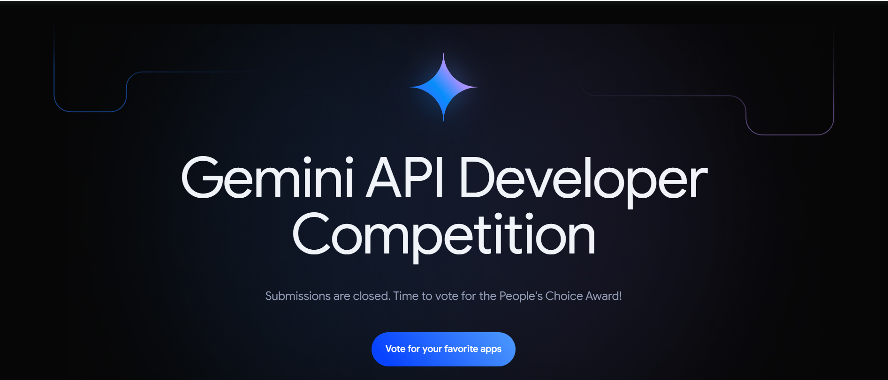

# Awesome Gemini Apps

## What is this repository?

This repository features a curated collection of nearly all the projects submitted to the Google Gemini API competition (more than 2800 projects). Each project entry includes:

- **Project Name**
- **Subtitle** (brief description)
- **YouTube Link** (demo video, if available)
- **What it Does** (detailed description of the project)
- **Built By** (developer or team name)
- **Location** (where the developer/team is from)
- **Project Link** (original project submission link)

Explore these inspiring projects and discover the full potential of the Google Gemini API.

**Note:** In this README, we provide a selection of projects. For the full list of projects (more than 2800 projects) and their detailed information, please refer to the `projects_data.csv` file available in the repository.

**Contributor's Note:** If you're the creator of any of the applications listed here, feel free to make a contribution to this repository to include your GitHub account for proper credit.

| **Project Name**                                                                                 | **Description**                                                                                                                                                                                | **By and Location**         | **Link**                                 |
|--------------------------------------------------------------------------------------------------|------------------------------------------------------------------------------------------------------------------------------------------------------------------------------------------------|-----------------------------|------------------------------------------|
| [1PUL](https://www.youtube.com/watch?v=dvV03UxqIOk)                                               | A Flutter app that tracks items using camera movement and stores inventory info in Google Sheets.                                                                                               | Brian Herbert, United States | [Link](https://ai.google.dev/competition/projects/1pul) |
| [3D Plant Facility Simulator](https://www.youtube.com/watch?v=xFMl0bGCGFs)                        | An educational 3D simulator using AI chatbots to teach about plant facilities.                                                                                                                  | أœbung, Brazil                | [Link](https://ai.google.dev/competition/projects/3d-plant-facility-simulator) |
| [3daiewer](https://www.youtube.com/watch?v=VFAc3MZfvYU)                                           | A 3D file viewer that allows users to query models using the Gemini API for AI insights.                                                                                                        | Ali, Pakistan                | [Link](https://ai.google.dev/competition/projects/3daiewer) |
| [4Habits](https://www.youtube.com/watch?v=oe2L_BHnHRY)                                            | A personalized habit tracker that suggests improvements based on health data using AI.                                                                                                          | 4Habits, Italy               | [Link](https://ai.google.dev/competition/projects/4habits) |
| [5min](https://www.youtube.com/watch?v=lCmWBuD0xYQ)                                               | An app where users spend 5 minutes daily discussing personal insights with AI.                                                                                                                  | 5min, United States          | [Link](https://ai.google.dev/competition/projects/5min) |
| [A Mommy](https://www.youtube.com/watch?v=SCbaHA_2Evk)                                            | A virtual mom assistant that sets alarms, tracks schedules, and reminds habits using the Gemini API.                                                                                            | Yoppy, South Korea           | [Link](https://ai.google.dev/competition/projects/a-mommy) |
| [A.I. E-Justice](https://www.youtube.com/watch?v=G-bCYoU8ySs)                                     | A mobile app that simplifies legal information for users using AI.                                                                                                                              | The RS, India                | [Link](https://ai.google.dev/competition/projects/ai-e-justice) |
| [Aarchid](https://www.youtube.com/watch?v=JRoQtHEF_oY)                                            | A plant monitoring system that helps gardeners care for plants with AI.                                                                                                                         | TreeTroopers, India          | [Link](https://ai.google.dev/competition/projects/aarchid) |
| [AAVA](https://www.youtube.com/watch?v=4pAGU9YhkKI)                                               | An AI virtual assistant designed to support ADEIN ambassadors by automating tasks and streamlining communication.                                                                                | Savannaspace, Kenya          | [Link](https://ai.google.dev/competition/projects/aava) |
| [AB Insta Caption Generator](https://www.youtube.com/watch?v=2WiO9nHJC-c)                         | An app that generates AI-powered Instagram captions for users' photos.                                                                                                                          | Team Astra, India            | [Link](https://ai.google.dev/competition/projects/ab-insta-caption-generator) |
| [Abhyas](https://www.youtube.com/watch?v=Kq3HWF7ny_g)                                             | A study assistant app that creates learning materials, Q&A exercises, and notes using AI.                                                                                                       | —                           | [Link](https://ai.google.dev/competition/projects/abhyas) |
| [2Clip](https://www.youtube.com/watch?v=7MRoFXpYVGQ)                                              | A macOS utility that captures copied items and instantly runs AI commands on them.                                                                                                              | —                           | [Link](https://ai.google.dev/competition/projects/2clip) |
| [3Lines](https://www.youtube.com/watch?v=QGz3-Ll7oqc)                                             | An app that generates 3-line summaries of technical articles using the Gemini API.                                                                                                              | Miyasic, Japan               | [Link](https://ai.google.dev/competition/projects/3lines) |
| [A conversation with Bill Gates](https://www.youtube.com/watch?v=aOzRpg7ueEo)                     | A chatbot simulating conversations with Bill Gates, covering various global topics.                                                                                                             | Infoedifice_Lee, South Korea | [Link](https://ai.google.dev/competition/projects/a-conversation-with-bill-gates) |
| [A10fy](https://www.youtube.com/watch?v=9L8HOfUlde4)                                              | A Chrome extension for AI-powered tasks and code execution directly on web pages using Gemini models.                                                                                           | Alex Dainiak, Armenia        | [Link](https://ai.google.dev/competition/projects/a10fy) |
| [Aboki AI](https://www.youtube.com/)                                                              | A personal finance assistant providing budget management and expense tracking via AI.                                                                                                           | —                           | [Link](https://ai.google.dev/competition/projects/aboki-ai) |
| [AAVA](https://www.youtube.com/watch?v=4pAGU9YhkKI)                                               | A virtual assistant app supporting non-profits with real-time communication and task automation via Gemini API.                                                                                 | Savannaspace, Kenya          | [Link](https://ai.google.dev/competition/projects/aava) |
| [A10fy](https://www.youtube.com/watch?v=9L8HOfUlde4)                                              | A browser extension for real-time AI code analysis and task management using Gemini models.                                                                                                     | Alex Dainiak, Armenia        | [Link](https://ai.google.dev/competition/projects/a10fy) |
| [A conversation with Bill Gates](https://www.youtube.com/watch?v=aOzRpg7ueEo)                     | An AI-powered chatbot simulating Bill Gates, providing valuable advice across various subjects.                                                                                                  | Infoedifice_Lee, South Korea | [Link](https://ai.google.dev/competition/projects/a-conversation-with-bill-gates) |
| [4Habits](https://www.youtube.com/watch?v=oe2L_BHnHRY)                                            | A habit tracker using AI to provide personalized health tips and progress updates.                                                                                                              | 4Habits, Italy               | [Link](https://ai.google.dev/competition/projects/4habits) |Here is the table format you requested 
| [AI Image Detector](https://www.youtube.com/watch?v=1A08Lt_Xd-c)             | Detects AI-generated images using advanced image analysis.                                                                                      | Debabrata Bepari, India              | [Link](https://ai.google.dev/competition/projects/ai-image-detector)              |
| [AI Image Prompting Solution](https://www.youtube.com/watch?v=E38_xNLjR6U)  | Generates and enhances AI image prompts with customizable parameters.                                                                           | Radhesyam Biswas, India              | [Link](https://ai.google.dev/competition/projects/ai-image-prompting-solution)    |
| [AI Journal Assistant](https://www.youtube.com/watch?v=5E9Wsvfx4aU)         | Creates an AI-driven autobiography based on daily journaling.                                                                                   | pillsbee, India                      | [Link](https://ai.google.dev/competition/projects/ai-journal-assistant)           |
| [AI Kit Brak](https://www.youtube.com/watch?v=iy1SA0IWfno)                  | Simplifies sales for small businesses using AI for product identification and chatbot integration.                                               | BWeird, Cambodia                     | [Link](https://ai.google.dev/competition/projects/ai-kit-brak)                    |
| [AI Learning Platform - Genius](https://www.youtube.com/watch?v=ZlKc7SBTcbg) | AI tutor solves problems from images, offering step-by-step solutions for students.                                                              | DeepMaze, United States              | [Link](https://ai.google.dev/competition/projects/ai-learning-platform-genius)    |
| [AI Legal Assistant](https://www.youtube.com/watch?v=aeEN7U3hk2Y)           | Drafts formal legal letters efficiently with Gemini API integration.                                                                            | ts, Poland                           | [Link](https://ai.google.dev/competition/projects/ai-legal-assistant)             |
| [AI Lyrics Checker](https://www.youtube.com/watch?v=66SSq54Utgc)            | Chrome extension checks song lyrics for explicit content using the Gemini API.                                                                   | Taylor English, United States        | [Link](https://ai.google.dev/competition/projects/ai-lyrics-checker)              |
| [AI Mentor](https://www.youtube.com/watch?v=v1AzV_NUgbU)                    | Creates personalized e-learning experiences using Gemini API for content generation and recommendations.                                         | AI Mentor, India                     | [Link](https://ai.google.dev/competition/projects/ai-mentor)                     |
| [AI Personal Shopper](https://www.youtube.com/watch?v=0OIG23Tr9yc)          | Assists with clothing shopping by providing personalized fashion critiques.                                                                      | GaryZ, United States                 | [Link](https://ai.google.dev/competition/projects/ai-personal-shopper)            |
| [AI Personalized Learning](https://www.youtube.com/watch?v=NqZJscyHhT0)     | Uses AI to create personalized curricula and lessons for lifelong learning.                                                                      | Türkiye                             | [Link](https://ai.google.dev/competition/projects/ai-personalized-learning)       |
| [AI Playground](https://www.youtube.com/watch?v=A24KG36sfW4)                | A game that uses AI to generate creative prompts and identify user-drawn images.                                                                 | Creative Krish, India                | [Link](https://ai.google.dev/competition/projects/ai-playground)                 |
| [AI Poem Generator](https://www.youtube.com/watch?v=33fqETTmzzo)            | Helps poets generate ideas and poems using the Gemini API.                                                                                       | Androi Dato, Egypt                   | [Link](https://ai.google.dev/competition/projects/ai-poem-generator)             |
| [AI Post](https://www.youtube.com/watch?v=cQky1JDhQIo)                      | Generates social media posts based on user-uploaded documents and images.                                                                        | Yuki Shiroma, Japan                  | [Link](https://ai.google.dev/competition/projects/ai-post)                       |
| [AI Powered Virtual Mentor](https://www.youtube.com/watch?v=nNWR3FNroww)    | Provides AI-driven mentorship and advice based on user input using the Gemini API.                                                               | Team Bharadwaj, India                | [Link](https://ai.google.dev/competition/projects/ai-powered-virtual-mentor)      |
| [AI Reactor](https://www.youtube.com/watch?v=uFhTjBkIpjo)                   | A web app for students to learn chemistry interactively with AI.                                                                                 | N/A                                  | [Link](https://ai.google.dev/competition/projects/ai-reactor)                    |
| [BIRD](https://www.youtube.com/watch?v=hv0eoUiVFZU) | Business insights and recommendations framework using Gemini API. | Sarath Babu, India | [Link](https://ai.google.dev/competition/projects/bird) |
| [Bite Grocery & Recipes](https://www.youtube.com/watch?v=eB38PS0_X4k) | AI-powered grocery list with recipe suggestions and real-time syncing. | Jamey, United States | [Link](https://ai.google.dev/competition/projects/bite-grocery-recipes) |
| [BizAchiever](https://www.youtube.com/watch?v=yQK3gkNY9sM) | WebApp for business documentation and poster quality checking using Gemini. | GM, India | [Link](https://ai.google.dev/competition/projects/bizachiever) |
| [BizBuddy](https://www.youtube.com/watch?v=NUzTLqy3njE) | Business management app for small business owners, using Gemini for data analysis. | BizBuddy, United States | [Link](https://ai.google.dev/competition/projects/bizbuddy) |
| [Black Leaf Streak Diagnostic (BLSD) App](https://www.youtube.com/watch?v=5yjkKFd9iYU) | Diagnoses black leaf streak in banana leaves using Gemini for disease severity and recommendations. | BLSD, Uganda | [Link](https://ai.google.dev/competition/projects/black-leaf-streak-diagnostic-blsd-app) |
| [Black Room](https://www.youtube.com/watch?v=Q5_AUw6LX7s) | Emotional support app targeting trauma and mental health through voice interaction and AI. | Kganya Maleka, South Africa | [Link](https://ai.google.dev/competition/projects/black-room) |
| [Blankies](https://www.youtube.com/watch?v=F9uwW27jqvE) | Helps users unwind with humorous stories generated from their daily logs. | Tessa Zhang, Singapore | [Link](https://ai.google.dev/competition/projects/blankies) |
| [BlazeTrade - Miss Market](https://www.youtube.com/watch?v=u-ym6O-k2AI) | Personalized trading assistant integrated with brokerage accounts. | BlazeTrade, United States | [Link](https://ai.google.dev/competition/projects/blazetrade-miss-market) |
| [Blind Companion](https://www.youtube.com/watch?v=sRLIBtMT8ls) | Assistive voice technology for blind users to navigate and browse the web. | World Assistants, Egypt | [Link](https://ai.google.dev/competition/projects/blind-companion) |
| [Blind Nav](https://www.youtube.com/watch?v=GD4iuPCIXTc) | Navigation and reading assistance for blind users, using Gemini to interpret surroundings. | Ahad's or Blind Nav, Pakistan | [Link](https://ai.google.dev/competition/projects/blind-nav) |
| [Career Coach AI](https://www.youtube.com/watch?v=d9VrkIcUF9E)                                                                                        | Helps create resumes, conduct mock interviews, and write cover letters tailored to job descriptions. | Abayomi Amusa, Nigeria  | [Link](https://ai.google.dev/competition/projects/career-coach-ai) |
| [Career Recommendation Analysis](https://www.youtube.com/watch?v=lUKE6ykjkKg)                                                                         | Uses photos, personality, and interests to design personalized career paths.                       | CHO SEUN, South Korea   | [Link](https://ai.google.dev/competition/projects/career-recommendation-analysis) |
| [CareerAdapt](https://www.youtube.com/watch?v=LtFZ20UhgCo)                                                                                            | Provides real-time career insights and personalized recommendations using AI.                      | Mission Automate, USA   | [Link](https://ai.google.dev/competition/projects/careeradapt) |
| [CareerAI](https://www.youtube.com/watch?v=8Hq5oe0tmD8)                                                                                               | Features resume building, CV reviews, and mock interview simulations with AI support.              | CareerAI, Vietnam       | [Link](https://ai.google.dev/competition/projects/careerai) |
| [CareerCraftML](https://www.youtube.com/watch?v=hlMW7BkSxow)                                                                                           | Offers resume suggestions, mock interviews, and PDF note interaction for career planning.          | Team Heisenberg, India  | [Link](https://ai.google.dev/competition/projects/careercraftml) |
| [CareerSculptor](https://www.youtube.com/watch?v=nXMzYP6xmJk)                                                                                         | Tailors resumes for job applications using AI suggestions and job fitment tools.                   | DLYog Lab, USA          | [Link](https://ai.google.dev/competition/projects/careersculptor) |
| [careerwise ai](https://www.youtube.com/watch?v=FEKXV55dgG8)                                                                                           | Provides personalized career guidance with AI and tailored lesson plans.                           | Theogene Junior, Uganda | [Link](https://ai.google.dev/competition/projects/careerwise-ai) |
| [CaregivrAI](https://www.youtube.com/watch?v=cuUAZhggoyg)                                                                                             | Coordinates caregiving tasks among family and friends, reducing stress and miscommunication.        | CaregivrAI, USA         | [Link](https://ai.google.dev/competition/projects/caregivrai) |
| [Carrboncy](https://www.youtube.com/watch?v=HGYrNWD6cZk)                                                                                              | Helps users repurpose waste items into useful products, rewarding them with "carbon currency."      | Xenonx7, India          | [Link](https://ai.google.dev/competition/projects/carrboncy) |
| [Carrier Genie / Carrier Mate](https://www.youtube.com/watch?v=IfTsZWpuzOs)                                                                            | Offers AI chat and interview question practice for various career paths.                           | Karan, India            | [Link](https://ai.google.dev/competition/projects/carrier-genie-carrier-mate) |
| [CarServe](https://www.youtube.com/watch?v=fAeWLZ1k48Y)                                                                                               | Analyzes vehicle damage and provides repair estimates using AI.                                    | Mobile Mechanics Masters, Indonesia | [Link](https://ai.google.dev/competition/projects/carserve) |
| [Cart Genie](https://www.youtube.com/watch?v=NmeLX-V0ClU)                                                                                             | Tracks grocery prices and helps compare prices across stores for better shopping decisions.         | Plottwixt, Canada       | [Link](https://ai.google.dev/competition/projects/cart-genie) |
| [DesignFusion](https://www.youtube.com/watch?v=tFa5tL5rbE0)                                               | AI-driven interior design app for personalized 3D home decor plans.  | India                   | [Link](https://ai.google.dev/competition/projects/designfusion)  |
| [Desktop](https://www.youtube.com/watch?v=sZI8tQB9LCQ)                                                    | Free learning platform with bite-sized courses on any subject.       | Clyce, Germany           | [Link](https://ai.google.dev/competition/projects/desktop)       |
| [DestinAI](https://www.youtube.com/watch?v=HS-KyrwVjDY)                                                   | AI trip planner with itineraries, flights, and hotel recommendations.| Akshat Jain, India       | [Link](https://ai.google.dev/competition/projects/destinai)      |
| [Destiny](https://www.youtube.com/watch?v=NFUvncsAXOI)                                                    | Todo app for managing goals and tasks using Gemini AI.               | Abdul Hanan, Pakistan    | [Link](https://ai.google.dev/competition/projects/destiny)       |
| [Devfolio](https://www.youtube.com/watch?v=62TLiscPPkY)                                                   | AI-based project brainstorming and development platform.             | Barysh Bacaltos, Philippines | [Link](https://ai.google.dev/competition/projects/devfolio)       |
| [Devium](https://www.youtube.com/watch?v=FdsTVG6p_pc)                                                     | AI travel planner with personalized itineraries and real-time tips.  | UnitioCode, Poland       | [Link](https://ai.google.dev/competition/projects/devium)        |
| [Devoxional](https://www.youtube.com/watch?v=y71qIk_zc-0)                                                 | AI-powered app for personalized Christian devotionals and studies.   | Anderson Daniel, Brazil  | [Link](https://ai.google.dev/competition/projects/devoxional)    |
| [DevSidekick](https://www.youtube.com/watch?v=LoFqn6ORqIA)                                                | Git commit summarizer with project history view powered by AI.       | CapyDevs, Latvia         | [Link](https://ai.google.dev/competition/projects/devsidekick)   |
| [DEWSClim](https://www.youtube.com/watch?v=xQgQukRZ2ZQ)                                                   | AI-based farming app providing weather and crop management tips.     | DEWSclim Innovators, Nigeria | [Link](https://ai.google.dev/competition/projects/dewsclim)       |
| [D-generate](https://www.youtube.com/watch?v=ObXx89MZZOc)                                                 | AI tool for generating dummy data based on user-defined schemas.     | India                   | [Link](https://ai.google.dev/competition/projects/d-generate)    |
| [EatWise](https://www.youtube.com/watch?v=tJ6gBTr74kM) | Meal plans tailored to different lifestyles, reduces food waste. | EatWise, Italy | [Link](https://ai.google.dev/competition/projects/eatwise) |
| [Eatz](https://www.youtube.com/watch?v=Yh0R7c_J2HQ) | Restaurant recommendations based on dietary needs and menus. | Pablo Nieuwenhuys, Simeon Nieuwenhuys, Ennio Binder, Austria | [Link](https://ai.google.dev/competition/projects/eatz) |
| [Eazy Phyzix](https://www.youtube.com/watch?v=5ZlmUbxLyg4) | Interactive physics simulations for education, easy and fun. | Kobar Septyanus, Indonesia | [Link](https://ai.google.dev/competition/projects/eazy-phyzix) |
| [E-Bike Buddy](https://www.youtube.com/watch?v=kCFEu5Q-IEY) | Diagnose e-bike issues and validate bike details. | E-Bike Buddy, India | [Link](https://ai.google.dev/competition/projects/e-bike-buddy) |
| [E-Bot English Practice Chatbot](https://www.youtube.com/watch?v=VA82S4BLnTs) | Improve English through conversations, with grammar correction. | vbookshelf, South Africa | [Link](https://ai.google.dev/competition/projects/e-bot-english-practice-chatbot) |
| [Echo Chamber](https://www.youtube.com/watch?v=thQDkvOUY4E) | Break down online echo chambers with sentiment analysis. | The Bubble Bursters, United States | [Link](https://ai.google.dev/competition/projects/echo-chamber) |
| [Echo Lens](https://www.youtube.com/watch?v=Pd4NGhKL77Y) | Assists visually impaired by converting images into audio. | New Way Solutions, United States | [Link](https://ai.google.dev/competition/projects/echo-lens) |
| [Echo Sight](https://www.youtube.com/watch?v=Ode20-0l49w) | Provides real-time audio descriptions for visually impaired. | Echo Sight, India | [Link](https://ai.google.dev/competition/projects/echo-sight) |
| [Echoes](https://www.youtube.com/watch?v=ibA3kFjwCrs) | Talk to historical characters like Aristotle in a live conversation. | Mellow, Lithuania | [Link](https://ai.google.dev/competition/projects/echoes) |
| [Eco](https://www.youtube.com/watch?v=jaY9GuGqVG4) | AI language tutor that adjusts to your skill level. | Alejandro Fuentes Cleto, Mexico | [Link](https://ai.google.dev/competition/projects/eco) |
| [Eco Cred](https://www.youtube.com/watch?v=iQvFjcPzVgA) | Track and reduce your carbon footprint with challenges and rewards. | Team ECO RECO, India | [Link](https://ai.google.dev/competition/projects/eco-cred) |
| [Eco Mentor](https://www.youtube.com/watch?v=ohp-kersORc) | Encourages sustainable living with personalized tasks. | Eco Mentor, India | [Link](https://ai.google.dev/competition/projects/eco-mentor) |
| [Eco Picker](https://www.youtube.com/watch?v=8reS2H0D3zo) | Turns litter cleanup into a fun, competitive game. | Eco Picker, Canada | [Link](https://ai.google.dev/competition/projects/eco-picker) |
| [Eco Safari](https://www.youtube.com/watch?v=pT4C-323-bI) | Environmental awareness app with AI-driven features and challenges. | Eco Safari, India | [Link](https://ai.google.dev/competition/projects/eco-safari) |
| [FeedbackJar](https://www.youtube.com/watch?v=0BBHxJZLFiY) | Simplifies feedback collection and writing by refining drafts and summarizing feedback. | Fontas Moraitis, Netherlands | [Link](https://ai.google.dev/competition/projects/feedbackjarcom) |
| [FeirasFacil](https://www.youtube.com/watch?v=rDwJyAqHaUs) | App for discovering and interacting with local market stalls and products. | FeirasFacil, Brazil | [Link](https://ai.google.dev/competition/projects/feirasfacil) |
| [Fellow](https://www.youtube.com/watch?v=DBdCSSSuqxk) | AI-powered writing feedback platform that offers live suggestions and detailed comments. | Wylie and Mason, United States | [Link](https://ai.google.dev/competition/projects/fellow) |
| [Fetebird](https://www.youtube.com/watch?v=DBcH8OSjkMk) | Enhances assignment grading with AI evaluations and feedback. | Fetebird, Australia | [Link](https://ai.google.dev/competition/projects/fetebird) |
| [Feycher](https://www.youtube.com/watch?v=L5j2_ZZ28cs) | Lets users create and customize AI chatbots with various functionalities. | Feycher, United States | [Link](https://ai.google.dev/competition/projects/feycher) |
| [Fiber Check](https://www.youtube.com/watch?v=wwj0TQm7J1c) | Converts food item inputs into nutritional data to help monitor fiber intake. | Caring Machines, Netherlands | [Link](https://ai.google.dev/competition/projects/fiber-check) |
| [FieldMaster](https://www.youtube.com/watch?v=kGDicDbDJQs) | Provides AI-driven recommendations based on satellite data for farming optimization. | FieldMaster, Romania | [Link](https://ai.google.dev/competition/projects/fieldmaster) |
| [Filkom Schools](https://www.youtube.com/watch?v=j_a714WLhRc) | Rewards students for educational activities and improves engagement through gamification. | Jatto, Nigeria | [Link](https://ai.google.dev/competition/projects/filkom-schools) |
| [FIMA Ai](https://www.youtube.com/watch?v=1SR_RG3X3_I) | Personalized financial planning with detailed reports and goal-setting advice. | Kukuh Tri, Indonesia | [Link](https://ai.google.dev/competition/projects/fima-ai) |
| [FinaBoard](https://www.youtube.com/watch?v=WEVroc5P8t8) | Automatically categorizes and analyzes transactions to provide financial insights. | Geminice, UK | [Link](https://ai.google.dev/competition/projects/finaboard) |
| [Finance Tracker](https://www.youtube.com/watch?v=zrnUxO0RSRo) | Tracks expenses by category and converts receipt images into digital transactions. | Team Exo, Romania | [Link](https://ai.google.dev/competition/projects/finance-tracker) |
| [FinanMe](https://www.youtube.com/watch?v=I5WcGB8X8HM) | Uses Gemini API models to identify, read, and categorize financial transactions and generate reports. | Dinho, Brazil | [Link](https://ai.google.dev/competition/projects/finanme) |
| [FindIT](https://www.youtube.com/watch?v=5ZgsR31TFFM) | AI-powered game that verifies objects in photos and generates riddles for users. | KaribKodes, Bangladesh | [Link](https://ai.google.dev/competition/projects/findit) |
| [FindSaaS](https://www.youtube.com/watch?v=_rPrmt6Ah0s) | Generates innovative micro SaaS ideas based on user inputs using AI. | HelloFaizan, India | [Link](https://ai.google.dev/competition/projects/findsaas) |
| [Findyouruniversity](https://www.youtube.com/watch?v=EHtGfDO_1Pc) | Centralizes university research information and provides AI-powered assistance for higher education decisions. | The Gurus, India | [Link](https://ai.google.dev/competition/projects/findyouruniversity) |
| [Fineprint](https://www.youtube.com/watch?v=OTB7hi-TkHg) | Chrome extension that decodes privacy policies and provides clear summaries and actionable insights. | Fineprint, India | [Link](https://ai.google.dev/competition/projects/fineprint) |
| [Gemini AI Professor](https://www.youtube.com/watch?v=CHBU3mGUxao) | Educational app for personalized learning using Gemini AI, supports various subjects and image-based problem solving. | Aryan Sarode, India | [Link](https://ai.google.dev/competition/projects/gemini-ai-professor) |
| [Gemini AI Resume Generator](https://www.youtube.com/watch?v=b32p1vVRf08) | Resume generator app that creates and refines resumes using Gemini AI, exporting them as polished PDFs. | None, Peru | [Link](https://ai.google.dev/competition/projects/gemini-ai-resume-generator) |
| [Gemini API Chatbot](https://www.youtube.com/watch?v=8Tn8KE379XI) | Chatbot using Gemini API and Firebase for user interaction with text and images. | DevNuture, Israel | [Link](https://ai.google.dev/competition/projects/gemini-api-chatbot) |
| [GEMINI AUTO BACKEND AI PROJECT](https://www.youtube.com/watch?v=mfiQpoPUO48) | Backend project using Gemini to generate, execute, and manage code for data operations. | Elijah Darkeh Agbedam and Augustine Love Stephens, Ghana | [Link](https://ai.google.dev/competition/projects/gemini-auto-backend-ai-project) |
| [Gemini Automod](https://www.youtube.com/watch?v=ZhkBaDjhE9s) | Moderation tool for Garry's Mod game servers using Gemini AI to suggest actions based on player activity logs. | vicentefelipechile, Chile | [Link](https://ai.google.dev/competition/projects/gemini-automod) |
| [Gemini Bot BD](https://www.youtube.com/watch?v=lpqeo9szeV0) | Telegram bot that engages users in conversations and provides information using Gemini API. | InfinityBytes, Bangladesh | [Link](https://ai.google.dev/competition/projects/gemini-bot-bd) |
| [Gemini Candlestick](https://www.youtube.com/watch?v=nJvH27cIxFo) | Investment simulator using technical analysis and AI insights for exploring financial markets. | Thailand | [Link](https://ai.google.dev/competition/projects/gemini-candlestick) |
| [Gemini Charity Cup](https://www.youtube.com/watch?v=SUwYDPgOBT8) | Football simulation game with charity donations and social campaigns integration. | Mohammed Agboola, Nigeria | [Link](https://ai.google.dev/competition/projects/gemini-charity-cup) |
| [Gemini Chat and Time-Travel Companion](https://www.youtube.com/watch?v=30D_znMgJxw) | Android app using Gemini API for real-time chat and time-travel features with various integrations. | CyberWorld-Soo-Na, Qatar | [Link](https://ai.google.dev/competition/projects/gemini-chat-and-time-travel-companion) |
| [Gemini Code Editor](https://www.youtube.com/watch?v=b4fkxoLoko4) | Coding tool with real-time suggestions and Google Drive integration using Gemini AI. | Dishant Singh, India | [Link](https://ai.google.dev/competition/projects/gemini-code-editor) |
| [Gemini Code Review](https://www.youtube.com/watch?v=Kj1z2Ma-CaQ) | Tool for code review in GitLab Merge Requests using Gemini AI for feedback. | Vietnam | [Link](https://ai.google.dev/competition/projects/gemini-code-review) |
| [Gemini Companion](https://www.youtube.com/watch?v=5pYqtxTe2o8) | Browser extension for chatting with Gemini model, analyzing content, and providing insights. | MD6, Vietnam | [Link](https://ai.google.dev/competition/projects/gemini-companion) |
| [Gemini CV](https://www.youtube.com/watch?v=jHNNeVSqJMI) | CV generator and optimizer using Gemini API to create high-quality resumes. | karlbreuer.com, Germany | [Link](https://ai.google.dev/competition/projects/gemini-cv) |
| [Gemini Dashboard](https://www.youtube.com/watch?v=Qr02KNunVME) | Platform for creating dynamic learning environments with customizable widgets and content. | Gemini Dashboard Builder, Singapore | [Link](https://ai.google.dev/competition/projects/gemini-dashboard) |
| [Gemini Davidayo AI](https://www.youtube.com/watch?v=1OWO3oDQj1w) | Gemini AI project using various integrations to handle text and multimodal prompts. | DAVIDAYO GEMINI AI, United States | [Link](https://ai.google.dev/competition/projects/gemini-davidayo-ai) |
| [Gemini Diagnostic Assistance](https://www.youtube.com/watch?v=dypKD3ea8oM) | AI application assisting doctors in diagnosing and managing patient care with secure integration. | Kapitel Hamid, Switzerland | [Link](https://ai.google.dev/competition/projects/gemini-diagnostic-assistance) |
| [Gemini Space Stories](https://www.youtube.com/watch?v=PQVgFNDIDvI) | AI-generated game with 100 levels, each featuring a unique story and riddle for players to solve within five minutes.                                                | Unity, Anime gamers, India | [Link](https://ai.google.dev/competition/projects/gemini-space-stories) |
| [Gemini Styler](https://www.youtube.com/watch?v=kofT4CWjfgM) | AI app recommending outfits from your closet based on personal style, occasion, weather, and calendar events.                                                         | Team Kerberos, India    | [Link](https://ai.google.dev/competition/projects/gemini-styler) |
| [Gemini Terminal](https://www.youtube.com/watch?v=WkUbWFw3QxE) | Intelligent terminal assistant for macOS integrating system commands and apps, including news summarization.                                                           | Germany                 | [Link](https://ai.google.dev/competition/projects/gemini-terminal) |
| [Gemini Time](https://www.youtube.com/watch?v=64ymYHR1cpw) | Web app with functionalities for quizzes, recipe creation, code review, and conversations with Gemini.                                                                  | India                   | [Link](https://ai.google.dev/competition/projects/gemini-time) |
| [Gemini Time Complexity](https://www.youtube.com/watch?v=dFLYuQSHXI4) | Web app to analyze the time complexity of any code.                                                                                                                   | Celeron Duo, India      | [Link](https://ai.google.dev/competition/projects/gemini-time-complexity) |
| [Gemini Time Quest](https://www.youtube.com/watch?v=E9Rycywm_fQ) | Mobile app offering quizzes, historical exploration, and future sustainability insights with AI-generated content.                                                      | Samuel Pérez Fernández, Spain | [Link](https://ai.google.dev/competition/projects/gemini-time-quest) |
| [Gemini Toolkit](https://www.youtube.com/watch?v=22wSCe8TEqY) | Platform to create, customize, and manage AI tools with support for node-based tool creation and tool sharing.                                                         | TechTonic, India        | [Link](https://ai.google.dev/competition/projects/gemini-toolkit) |
| [Gemini Tools](https://www.youtube.com/watch?v=WAeOXHd2jJQ) | Flutter app integrating Gemini for tools like a chatbot, picture detector, text summarizer, and a feedback screen with mode options.                                   | Geminiers, India        | [Link](https://ai.google.dev/competition/projects/gemini-tools) |
| [Gemini Travel Planner](https://www.youtube.com/watch?v=QHjbIgVubSk) | App for eco-friendly travel planning, offering trip suggestions and insights based on user inputs.                                                                      | Stormin, United States  | [Link](https://ai.google.dev/competition/projects/gemini-travel-planner) |
| [Gemini Voice Companion](https://www.youtube.com/watch?v=6eXayNvU6ds) | Voice assistant with capabilities for voice interaction, smart home control, and various personal tasks.                                                                 | Zhenya Yang, Australia  | [Link](https://ai.google.dev/competition/projects/gemini-voice-companion) |
| [Gemini Wellness Metrics](https://www.youtube.com/watch?v=vmo82LBWLC0) | Health management app tracking metrics like BMI and BMR with chatbot support for personalized health insights.                                                           | Safia team, Saudi Arabia | [Link](https://ai.google.dev/competition/projects/gemini-wellness-metrics) |
| [Gemini X Auth](https://www.youtube.com/watch?v=tCKymeNgdVE) | AI app supporting individuals with autism through emotion detection, interactive maps, and a voice assistant.                                                             | Flavio Cerato, Italy    | [Link](https://ai.google.dev/competition/projects/gemini-x-auth) |
| [Gemini YouTube Assistant](https://www.youtube.com/watch?v=3alzdxFzIqk) | Analyzes video/audio content to generate SEO-optimized titles, descriptions, tags, and social media posts.                                                               | Carlos Alarcón, Colombia | [Link](https://ai.google.dev/competition/projects/gemini-youtube-assistant) |
| [gemini_ai_new](https://www.youtube.com/watch?v=GM6bQk1XjYs) | AI conversational assistant with multimodal interactions and chat history management using Flutter and Firebase.                                                        | Tech-Titan, India       | [Link](https://ai.google.dev/competition/projects/gemini-ai-new) |
| [GEMINI_API_2](https://www.youtube.com/watch?v=cavIXXLJ42c) | Application accessing NASA’s Apollo 11 mission data using Gemini API for insights and summaries from text, images, and videos.                                           | Dr. Kolapo, Nigeria     | [Link](https://ai.google.dev/competition/projects/gemini-api-2) |
| [Gemini-AI Terminal based Chatbot](https://www.youtube.com/watch?v=v_fcHpl-ti0) | CLI-based chatbot integrating Gemini API with text and image inputs for content generation and customization options.                                                     | Alham's Conclave, Sri Lanka | [Link](https://ai.google.dev/competition/projects/gemini-ai-terminal-based-chatbot) |
| [GeminiBedtimestory](https://www.youtube.com/watch?v=hTIkGOVeGMg) | Bedtime story generator web app using Google Gemini API and Vite React to create personalized stories for children.                                                       | Gemini team, Senegal    | [Link](https://ai.google.dev/competition/projects/geminibedtimestory) |
| [InVision](https://www.youtube.com/watch?v=ZfETT-D4Fpc) | AI tool for career feedback and mock interviews, using AI to analyze resumes and job descriptions. | Wassim Jabrane, UK | [Link](https://ai.google.dev/competition/projects/invision) |
| [InvoiX](https://www.youtube.com/watch?v=nI_AbAhA75A) | AI-based invoice reader that categorizes and analyzes invoices, saving time and reducing errors. | SC-Riber, Türkiye | [Link](https://ai.google.dev/competition/projects/invoix) |
| [I-Report](https://www.youtube.com/watch?v=7cBhImFz_nc) | Optimizes customer service processes with real-time data analysis for quality control. | X3M Motion, Brazil | [Link](https://ai.google.dev/competition/projects/i-report) |
| [IRIS 1](https://www.youtube.com/watch?v=WRx_03QeXAc) | Detects and censors sensitive information in videos before they are published. | Iris, United States | [Link](https://ai.google.dev/competition/projects/iris-1) |
| [Iron Track](https://www.youtube.com/watch?v=cRgT7OaOKac) | Provides AI-generated fitness insights, motivational messages, and workout challenges. | Dager Zuniga - Dhyuti Patel, United States | [Link](https://ai.google.dev/competition/projects/iron-track) |
| [IRO-The Colour Analyser](https://www.youtube.com/watch?v=ud6EwaeRdgc) | AI-based color analysis for fashion, recommending clothing colors based on photo uploads. | Team Doom , India | [Link](https://ai.google.dev/competition/projects/iro-the-colour-analyser) |
| [IslamChat](https://www.youtube.com/watch?v=_0iAwApeEwI) | AI religious counselor using a dataset of Islamic jurisprudence to provide accurate responses. | deen.ai, UK | [Link](https://ai.google.dev/competition/projects/islamchat) |
| [iSpy Predator Reporter](https://www.youtube.com/watch?v=16ynlldGjBo) | Detects online predators in Discord using Gemini, with options to report or save evidence. | Google Gremlins, United States | [Link](https://ai.google.dev/competition/projects/ispy-predator-reporter) |
| [IT News Pickles](https://www.youtube.com/watch?v=GwHkXifN_UE) | Aggregates and highlights news articles from RSS feeds based on user interests. | stkdev, Japan | [Link](https://ai.google.dev/competition/projects/it-news-pickles) |
| [ItinerAI](https://www.youtube.com/watch?v=fiGCWxLx9Dc) | AI-based travel planner creating detailed itineraries and trip plans based on user preferences. | Punchi Samanallu, Sri Lanka | [Link](https://ai.google.dev/competition/projects/itinerai) |
| [iTravel](https://www.youtube.com/watch?v=Ttnt5T7_oMc) | AI-powered travel planner providing personalized trip plans, flights, and hotel options. | iTravel, Nigeria | [Link](https://ai.google.dev/competition/projects/itravel) |
| [IType](https://www.youtube.com/watch?v=s74NT9Jg_yg) | AI-powered typewriter that auto-completes text and offers a vintage writing experience. | -, Canada | [Link](https://ai.google.dev/competition/projects/itype) |
| [iVA Mate](https://www.youtube.com/watch?v=HuqK6xTK5kc) | Enhances metaverse interactions with AI processing for text and image-based communication. | Team iVA Mates, India | [Link](https://ai.google.dev/competition/projects/iva-mate) |
| [Jadosi](https://www.youtube.com/watch?v=k2Fkdnj94uQ) | AI-driven tool for improving job applications and resumes, focusing on underrepresented minorities. | Jadosi, United States | [Link](https://ai.google.dev/competition/projects/jadosi) |
| [Jamani](https://www.youtube.com/watch?v=rRLToCc6JAk) | AI assistant for farmers offering advice on crop health and optimal practices based on image analysis. | Hisia Designs, Kenya | [Link](https://ai.google.dev/competition/projects/jamani) |
| [Jana AI](https://www.youtube.com/watch?v=JOcDMDG8u68) | AI-driven journaling app that analyzes daily activities and emotions to provide mental health insights. |  -,-  | [Link](https://ai.google.dev/competition/projects/jana-ai) |
| [Make Your Travel](https://www.youtube.com/watch?v=8o7yW5PdDEs) | Application to create travel itineraries, allowing search for trips from photos, predefined suggestions, or free fields. | Flutter, Brazil | [Link](https://ai.google.dev/competition/projects/make-your-travel) |
| [malayaleeai](https://www.youtube.com/watch?v=nZbhLv2FKu8) | Web app for translating and processing text in Malayalam and English using Gemini API. | Afnan, India | [Link](https://ai.google.dev/competition/projects/malayaleeai) |
| [MalcMind AI Job Helper](https://www.youtube.com/watch?v=Vk0l44LO8ro) | Chrome Extension that tracks jobs, autofills applications, and organizes job searches. | MalcMind, United States | [Link](https://ai.google.dev/competition/projects/malcmind-ai-job-helper) |
| [MaLEAA](https://www.youtube.com/watch?v=Lvxxa59Da08) | Uses Flutter and Firebase to manage phone calls, interact with agents using text-to-speech and speech-to-text. | Dylan and Future Dylan, United States | [Link](https://ai.google.dev/competition/projects/maleaa) |
| [Mama Giani](https://www.youtube.com/watch?v=rt0_nvjueK0) | Chatbot for cooking traditional Peruvian recipes with Firebase Auth and Firestore integration. | OnSuitDevs, Peru | [Link](https://ai.google.dev/competition/projects/mama-giani) |
| [MamAI](https://www.youtube.com/watch?v=ypLmvbsUeU0) | AI-powered companion for moms offering personalized recipes, advice, and quotes. | Google Studio, Moms in Tech, Germany | [Link](https://ai.google.dev/competition/projects/mamai) |
| [MantisGem](https://www.youtube.com/watch?v=PwykrMWl1jQ) | AI-powered app that uses Gemini to gather user preferences and recommend activities. | No Veni Vedi Vici, Venam Vidu Machi!, United States | [Link](https://ai.google.dev/competition/projects/mantisgem) |
| [MaPi](https://www.youtube.com/watch?v=x8R4cyzmy24) | Personal guide that syncs with Google Maps to recommend food or drink spots based on user preferences. | Mahya - Piyush, France | [Link](https://ai.google.dev/competition/projects/mapi) |
| [Maple](https://www.youtube.com/watch?v=DhXMVrtZhyU) | Travel assistant providing recommendations based on location, preferences, and weather. | Oscar Muya, Kenya | [Link](https://ai.google.dev/competition/projects/maple) |
| [marketBiz.ai](https://www.youtube.com/watch?v=lS7bzzmatAQ) | App that analyzes government tenders using AI, offering actionable insights for small businesses. | Diego Vargas y Javier Vasquez, Colombia | [Link](https://ai.google.dev/competition/projects/marketbizai) |
| [Marmar](https://www.youtube.com/watch?v=65OJAaydy-A) | Health management platform with medication alerts, personalized advice, and health history tracking. | Marmar, Nigeria | [Link](https://ai.google.dev/competition/projects/marmar) |
| [Marmelo Academy](https://www.youtube.com/watch?v=drUUVjmppgc) | Facilitates team formation and project development with AI support for brainstorming and documentation. | Marmelo Academy, Japan | [Link](https://ai.google.dev/competition/projects/marmelo-academy) |
| [Marty Terminal](https://www.youtube.com/watch?v=c-O0-g6OV3Q) | AI-powered command-line assistant that simplifies tasks by interpreting natural language commands. | FleiTec SoftwareEntwicklung, Austria | [Link](https://ai.google.dev/competition/projects/marty-terminal) |
| [MateVerse](https://www.youtube.com/watch?v=AOnNHJ8NH6M) | AI-powered dating platform using multi-agent systems to match users through conversations. | India | [Link](https://ai.google.dev/competition/projects/mateverse) |
| [Math Solver AI - Math notes](https://www.youtube.com/watch?v=a2CcQ_zmPkU) | App that solves math problems through images, text input, or drawings, explaining steps in LaTeX. | Megatron, Vietnam | [Link](https://ai.google.dev/competition/projects/math-solver-ai-math-notes) |
| [Math Warrior](https://www.youtube.com/watch?v=-5rUtjOeyxQ) | Game that combines math learning with fun, using AI to provide hints and challenges. | the_AshishGuy, India | [Link](https://ai.google.dev/competition/projects/math-warrior) |
| [MoodMind](https://www.youtube.com/watch?v=vYwS1ThBzNE) | Personalized emotion detection with recommendations based on mood. | BeezGroup, Uganda                           | [Link](https://ai.google.dev/competition/projects/moodmind) |
| [Moom](https://www.youtube.com/watch?v=8tEQFdwWVT4) | AI design kit for interior design, combining 2D and 3D models for accurate results. | Maitai Kunawong, Praejeen Kunawong, Sopitta Thurachen, Krongkwan Kananurak, Thailand | [Link](https://ai.google.dev/competition/projects/moom) |
| [Moonect](https://www.youtube.com/watch?v=gkvugLHajX8) | Connects users to chat groups based on objects in their photos, with AI chat options. | Chaudhry Talha, Malaysia                   | [Link](https://ai.google.dev/competition/projects/moonect) |
| [MoonMakers Education](https://www.youtube.com/watch?v=WPPoM04QWJw) | Project-based learning platform with AI-driven educational resources. | MoonMakers, Mexico                         | [Link](https://ai.google.dev/competition/projects/moonmakers-education) |
| [Moonolog](https://www.youtube.com/watch?v=ybJlM0FV11E) | Journal app with AI to analyze emotions and provide insights and affirmations. | anirudhisonline, India                      | [Link](https://ai.google.dev/competition/projects/moonolog) |
| [Moospire](https://www.youtube.com/watch?v=MHHWAHAJpoI) | AI tool for creating moodboards from sketches, images, and web screenshots. | Michael Ajala, Nafiu Sofiat, UK             | [Link](https://ai.google.dev/competition/projects/moospire) |
| [Moral](https://www.youtube.com/watch?v=PiVBfpbMWo8) | AI-powered educational web app focusing on soft skills with culturally relevant content. | ENCG Casablanca, Morocco                    | [Link](https://ai.google.dev/competition/projects/moral) |
| [Mosaic Learn](https://www.youtube.com/watch?v=vDkt2xQK4ZA) | Mobile app that scans textbook pages and links to YouTube videos for learning. | Reality5D, United States                   | [Link](https://ai.google.dev/competition/projects/mosaic-learn) |
| [MotherEarth](https://www.youtube.com/watch?v=fbPBCLlktWQ) | Web app providing location-specific weather insights and recommendations. | Aaron & Adam, Uganda                        | [Link](https://ai.google.dev/competition/projects/motherearth) |
| [Motion Magic](https://www.youtube.com/watch?v=eUkOXYj_hd8) | AI-powered physics education tool offering detailed, step-by-step solutions. | Motion Magic, United States                | [Link](https://ai.google.dev/competition/projects/motion-magic-physics-simulator) |
| [Motivia](https://www.youtube.com/watch?v=EZbnusc9b_s) | Multilingual support chat AI offering emotional assistance and crisis support. | Motivia, Spain                              | [Link](https://ai.google.dev/competition/projects/motivia) |
| [Mouth Watering Chat](https://www.youtube.com/watch?v=KERy8cU3mR8) | Web app for chatting with vegan restaurant menus and making recommendations. | United States                                | [Link](https://ai.google.dev/competition/projects/mouth-watering-chat) |
| [Movify](https://www.youtube.com/watch?v=2X8k-N8D5lU) | Recommends movies and helps find a movie buddy. | Etugen, Türkiye                             | [Link](https://ai.google.dev/competition/projects/movify) |
| [Movviu](https://www.youtube.com/watch?v=EvJTtNojfiI) | AI-driven platform for democratizing movie reviews. | Irfan Rahadian Adriyanto, Indonesia         | [Link](https://ai.google.dev/competition/projects/movviu) |
| [Mowy](https://www.youtube.com/watch?v=0gPQIl6-U4E) | AI tool for reading, categorizing, and managing financial transactions from PDFs. | Mowy - Your finance teammate, Spain          | [Link](https://ai.google.dev/competition/projects/mowy) |
| [MP3 Downloader - AT Music Player](https://www.youtube.com/watch?v=GfFzUX6thDk) | Music player with AI features for transforming and personalizing music experiences. | Super Music Player Downloader, United States | [Link](https://ai.google.dev/competition/projects/mp3-downloader-at-music-player) |
| [Perspective](https://www.youtube.com/watch?v=HT5fIAjKSmY)           | AI-powered fact-checking platform that consolidates research and provides additional context for posts, images, or articles. Users can view analysis and community feedback.                                                                                              | hellothere, Canada                   | [Link](https://ai.google.dev/competition/projects/perspective)            |
| [Perspective-Check](https://www.youtube.com/watch?v=0AoII33WYRI)       | Tool for transforming academic writing to promote inclusivity by identifying and addressing non-person-centered language in documents.                                                                                                                             | Inclusion innovators, United States | [Link](https://ai.google.dev/competition/projects/perspective-check)       |
| [Pet Care](https://www.youtube.com/watch?v=_uzpvoHodH0)                | App for managing pet health, including a symptom checker and daily health suggestions, powered by the Gemini API.                                                                                                                                                   | Pad kaprao, Thailand                 | [Link](https://ai.google.dev/competition/projects/pet-care)                |
| [PETI-PETI](https://www.youtube.com/watch?v=ddce1uN40hg)              | Web app for curating and sharing knowledge using Gemini API in customizable boxes. Integrates with Firebase and offers features like box grouping and Gen AI responses.                                                                                              | Zaha Rina & Edward Chin from Tepuk-Tepuk, Malaysia | [Link](https://ai.google.dev/competition/projects/peti-peti)               |
| [PetReady](https://www.youtube.com/watch?v=0GL477RgbNQ)                | App for assessing readiness for pet ownership with AR features and Gemini API-driven personalized content and recommendations.                                                                                                                                        | PetReady, United States              | [Link](https://ai.google.dev/competition/projects/petready)               |
| [PetVision](https://www.youtube.com/watch?v=RZzCnpZ1xOc)              | Smart pet monitoring app with AI-powered alerts and analytics using Gemini API to track activities and behavior patterns.                                                                                                                                             | Brazil                               | [Link](https://ai.google.dev/competition/projects/petvision)              |
| [Photo Scan by Photomyne](https://www.youtube.com/watch?v=kJww1LGGhdw) | App for digitizing printed photos with automation for cropping, rotating, and enhancing. Uses Gemini API for automatic date and location tagging.                                                                                                                     | The Photomyne team, Israel           | [Link](https://ai.google.dev/competition/projects/photo-scan-by-photomyne)|
| [photo to movie story](https://www.youtube.com/watch?v=7xHn7Vym2W8)   | Creates movie stories from images by combining them with text prompts, using Gemini API to generate narratives and ensure safety in content.                                                                                                                             | AIyou, South Korea                   | [Link](https://ai.google.dev/competition/projects/photo-to-movie-story)   |
| [Photobox for Kids](https://www.youtube.com/watch?v=TPPzj__Qv3A)       | Interactive system for enhancing family interactions and education, using AI to identify and describe objects captured by children.                                                                                                                                 | Photobox for Kids, United States      | [Link](https://ai.google.dev/competition/projects/photobox-for-kids)      |
| [PhotoChat](https://www.youtube.com/watch?v=eHkX_69UXz4)              | App for dyslexia support that generates relevant questions and answers from images using Gemini, with features for image editing and accessibility support.                                                                                                               | PhotoChat Team, Germany              | [Link](https://ai.google.dev/competition/projects/photochat)              |
| [Photofeast](https://www.youtube.com/watch?v=MfiuJCQWkaw)              | Generates recipes from photos of ingredients using Gemini API's image-to-text capabilities, with support for dietary preferences.                                                                                                                                     | Photofeast, United States            | [Link](https://ai.google.dev/competition/projects/photofeast)             |
| [PhrasnAI](https://www.youtube.com/watch?v=kSekENwv5K8)               | Elevates student knowledge by translating prompts to English, gathering data, and answering questions in native languages using Gemini.                                                                                                                               | Phrasn, United States                | [Link](https://ai.google.dev/competition/projects/phrasnai)               |
| [Picki Trips](https://www.youtube.com/watch?v=3tCr9Qh8uFA)            | App for personalized trip planning, providing trip options and detailed recommendations with Gemini's help. Includes features for booking and guide customization.                                                                                                      | Kala Nicholson, United States        | [Link](https://ai.google.dev/competition/projects/picki-trips)            |
| [Pico](https://www.youtube.com/watch?v=RL8vKh9aH2c)                  | App for generating product descriptions from images using Gemini, with additional features for motivational tips and advice.                                                                                                                                           | Dynaimx, India                       | [Link](https://ai.google.dev/competition/projects/pico)                   |
| [PicPaz](https://www.youtube.com/watch?v=z7WkHMYUL_Q)                | Mobile app for identifying food from images and providing recipes using Gemini AI, with features for saving favorites and setting dietary preferences.                                                                                                                   | akbar rasirahimi, Türkiye            | [Link](https://ai.google.dev/competition/projects/picpaz)                |
| [PicSearch](https://www.youtube.com/watch?v=MiDinJt8K8E)              | App that generates context and keywords for images using Gemini API, enhancing semantic search functionality.                                                                                                                                                      | InnoVision, India                    | [Link](https://ai.google.dev/competition/projects/picsearch)             |
| [Pictorica](https://www.youtube.com/watch?v=BlGpkClaqrA)              | App for crafting creative stories from pictures and prompts, using Gemini API for interactive storytelling, semantic retrieval, and performance analytics.                                                                                                               | HYFORCE, India                       | [Link](https://ai.google.dev/competition/projects/pictorica)             |
| [Pill Point](https://www.youtube.com/watch?v=Pc_vjbKOzV4)             | Mobile app for medication adherence, using Gemini API to create personalized schedules, provide educational resources, and track adherence.                                                                                                                             |                                     | [Link](https://ai.google.dev/competition/projects/pill-point)            |
| [RAGConstruction](https://www.youtube.com/watch?v=buEiHnOPhso) | Uses Google API for safe building methods. | Humble Construction, Uganda | [Link](https://ai.google.dev/competition/projects/ragconstructionipynb) |
| [Ranksper AI Studio](https://www.youtube.com/watch?v=9lSGyUk4Das) | Provides AI prompts and chatbots specialized for tasks like SEO and marketing, with a custom prompt library. | Ranksper, India | [Link](https://ai.google.dev/competition/projects/ranksper-ai-studio) |
| [Rapha AI](https://www.youtube.com/watch?v=QClo_hc5xeI) | Streamlines maternal care with faster ultrasound analysis and instant reports. | Lawal OLuwatimileyin and Orewole Rahman, Nigeria | [Link](https://ai.google.dev/competition/projects/rapha-ai) |
| [Rapid Mastery](https://www.youtube.com/watch?v=lyv2sO1uZhM) | Enables users to create and practice challenges with AI-generated questions and insights. | Rapid Mastery, Egypt | [Link](https://ai.google.dev/competition/projects/rapid-mastery) |
| [Rashid](https://www.youtube.com/watch?v=vJRuAx9N6po) | AI-powered app for personalized learning, creating curriculums, and providing interactive lessons. | Ahmed Elsayed Khalafallah, Egypt | [Link](https://ai.google.dev/competition/projects/rashid) |
| [rate-you](https://www.youtube.com/watch?v=9zfskK80uK4) | AI-powered feedback platform for rating and improving photos with community interaction. | martian.07, India | [Link](https://ai.google.dev/competition/projects/rate-you) |
| [Razzle AI](https://www.youtube.com/watch?v=9afyf7ZdFkE) | Analyzes stock market trends and predicts future prices with precision. | Coder Army, India | [Link](https://ai.google.dev/competition/projects/razzle-ai) |
| [Readily](https://www.youtube.com/watch?v=84CySBZD9fE) | Provides personalized therapy roadmaps and tracks progress using Gemini AI. | Anh L., United States | [Link](https://ai.google.dev/competition/projects/readily) |
| [ReadQuest](https://www.youtube.com/watch?v=2msePYz-nqI) | Chrome extension that generates interactive MCQs from blog content to enhance reading comprehension. | CodeCrafters, India | [Link](https://ai.google.dev/competition/projects/readquest) |
| [ReadyApp](https://www.youtube.com/watch?v=RaxhT15WUo0) | Organizes trips with cost and recommendation features, including accommodation and etiquette. | Pedro Gimpietro, Brazil | [Link](https://ai.google.dev/competition/projects/readyapp) |
| [Real-Time Vegetation Index Analysis](https://www.youtube.com/watch?v=_aaIVNpXNgg) | Monitors and analyzes vegetation health in real-time using image data. | Emmanuel Echeonwu, Nigeria | [Link](https://ai.google.dev/competition/projects/real-time-vegetation-index-analysis) |
| [ReBased](https://www.youtube.com/watch?v=acKcQDapK6w) | App that categorizes posts to promote local social interactions and reconnect users. | Aurélien Coppée & Neïl Rahmouni, Belgium | [Link](https://ai.google.dev/competition/projects/rebased) |
| [Recap](https://www.youtube.com/watch?v=i4z-3mntmK4) | Note-taking app that generates key points and interactive quizzes from notes using AI. | Juyeong "James" Noh, South Korea | [Link](https://ai.google.dev/competition/projects/recap) |
| [Recap - Book Summaries by AI](https://www.youtube.com/watch?v=-4vywDJI2-g) | Converts books into audio summaries with Gemini AI, formatted into JSON. | TaskHeld, Germany | [Link](https://ai.google.dev/competition/projects/recap-book-summaries-by-ai) |
| [SB-AI](https://www.youtube.com/watch?v=E_G9SpgWyvA) | Compares LLM and RAG-enhanced AI to improve response accuracy, using an anime app as a demonstration. | YusukeTomy, Japan | [Link](https://ai.google.dev/competition/projects/sb-ai-select-better-ai) |
| [Scaffolder](https://www.youtube.com/watch?v=_psL1onR4Mg) | AI-driven app that helps users organize and complete creative projects with automated scheduling. | Scaffolder, Taiwan | [Link](https://ai.google.dev/competition/projects/scaffolder) |
| [Scammune](https://www.youtube.com/watch?v=fResYBzpG7w) | Detects and remediates cyber scams through message and link analysis, with virtual police capabilities. | Scam busters, India | [Link](https://ai.google.dev/competition/projects/scammune) |
| [ScanKart](https://www.youtube.com/watch?v=uBBpZLYDtww) | AI-enhanced platform for retail, integrating with WhatsApp for inventory management and shopping. | [Ashutosh Sahu](https://devashu.me/), India | [Link](https://ai.google.dev/competition/projects/scankart) |
| [Scene Report](https://www.youtube.com/watch?v=R_eMemLBbw0) | Converts multimedia from emergency calls into detailed textual descriptions to aid in emergency response. | Just me, Canada | [Link](https://ai.google.dev/competition/projects/scene-report) |
| [Schedule X](https://www.youtube.com/watch?v=TVUr6Uy209k) | Scheduling app with AI image scanning and customizable alarms for better time management. | Frameins, Thailand | [Link](https://ai.google.dev/competition/projects/schedule-x) |
| [Schmaybe](https://www.youtube.com/watch?v=3JaMzK0okIM) | Log monitoring tool with WebSocket support for message analysis and advanced AI features. | User Level Up, United States | [Link](https://ai.google.dev/competition/projects/schmaybe) |
| [Scott Hatfield](https://www.youtube.com/watch?v=A95_u1uEVhM) | Project-based learning app with Gemini AI for creating and managing custom learning projects. | Scott Hatfield, United States | [Link](https://ai.google.dev/competition/projects/scott-hatfield) |
| [Screenchat](https://www.youtube.com/watch?v=cM5MRK7Ek8Y) | AI assistant that analyzes screen content and audio to provide context-aware assistance and knowledge sharing. | Suman Mondal, India | [Link](https://ai.google.dev/competition/projects/screenchat) |
| [ScreenPlays](https://www.youtube.com/watch?v=SNvgUgn2nf8) | Game where players write and vote on movie titles for random descriptions, enhanced with Gemini AI. | Heist Creative Collective, United States | [Link](https://ai.google.dev/competition/projects/screenplays) |
| [ScriptWizzy](https://www.youtube.com/watch?v=FdXop6t1K8o) | AI-powered tool for generating and editing engaging video scripts based on user input. | Harrison, Brazil | [Link](https://ai.google.dev/competition/projects/scriptwizzy) |
| [Scryptify](https://www.youtube.com/watch?v=SJ4wHKsoUdA) | Video content management platform with semantic search and Gemini AI for interactive video experiences. | Scryptify, UK | [Link](https://ai.google.dev/competition/projects/scryptify) |
| [Search In Videos With Gemini Ai](https://www.youtube.com/watch?v=7PFN1Ta-fls) | AI-based keyword search to find exact timestamps in videos where keywords appear. | Türkiye | [Link](https://ai.google.dev/competition/projects/search-in-videos-with-gemini-ai) |
| [Thomas And Friends](https://www.youtube.com/watch?v=a6FDe7L2Bg4) | Multi-agent chat flow in Firebase cloud integrating various AI agents for travel company client service. | VistaTech, Malta | [Link](https://ai.google.dev/competition/projects/thomas-and-friends) |
| [Thomas Djotio Ndie](https://www.youtube.com/watch?v=zVEEaxIYjdo) | SNAPPY enhances user interactions with chatbots through various modes and Google Gemini API integration for advanced conversational AI. | Yowyob Snappy, Cameroon | [Link](https://ai.google.dev/competition/projects/thomas-djotio-ndie) |
| [Threadeo 2.O](https://www.youtube.com/watch?v=Zc6wrPGSHfM) | Communication platform integrating chat and content generation with personalized updates and engagement features. | Purna ChandraShekar Giduthuri, India | [Link](https://ai.google.dev/competition/projects/threadeo-2o) |
| [Three Reads](https://www.youtube.com/watch?v=ODZVvMLsLds) | Recommends three books based on user's favorites using the Gemini API and Google Books API for personalized suggestions. | Saudi Arabia | [Link](https://ai.google.dev/competition/projects/three-reads) |
| [Thryving](https://www.youtube.com/watch?v=MkqFDd1_rj8) | Self-care assistant creating and optimizing routines with Gemini AI for mental health and personal growth. | Monika Dogra, Ekya Dogra, Agneya Tharun, Murari Ambati, Rizky Surya, United States | [Link](https://ai.google.dev/competition/projects/thryving) |
| [Thunder](https://www.youtube.com/watch?v=k48jrx4XLzY) | AI app utilizing Gemini API for content generation, idea brainstorming, and creating engaging content across various formats. | XCode team, Egypt | [Link](https://ai.google.dev/competition/projects/thunder) |
| [Tichika](https://www.youtube.com/watch?v=i9LVuzctv7U) | Edutech app supporting students with reading and question-asking through a Gemini AI chatbot. | TICHIKA, Tanzania | [Link](https://ai.google.dev/competition/projects/tichika) |
| [TicketGenie AI](https://www.youtube.com/watch?v=BCDvCjVgRNs) | Intelligent ticketing system providing quick fixes and automated solutions for IT support issues. | AMJAD V K, India | [Link](https://ai.google.dev/competition/projects/ticketgenie-ai) |
| [TidBits](https://www.youtube.com/watch?v=CoitFfNF1_w) | Creates study cards easily with Gemini AI, tracking progress and providing a fun learning experience. | James Campbell, United States | [Link](https://ai.google.dev/competition/projects/tidbits) |
| [TidBits AI](https://www.youtube.com/watch?v=ueyqm7BbDFI) | Elevates junk items to creative uses with Gemini AI by analyzing images and generating reuse ideas. | TidBits AI, Netherlands | [Link](https://ai.google.dev/competition/projects/tidbits-ai) |
| [Tiejun Hou](https://www.youtube.com/watch?v=T8hNV3PK7hg) | Reading assist system with three levels: knowledge base, book, and page, using Gemini for information generation. | HouTiejun, Canada | [Link](https://ai.google.dev/competition/projects/tiejun-hou) |
| [Tiger[A]Eye](https://www.youtube.com/watch?v=HcPQj2qaAOM) | Research assistant for NBIA researchers providing comprehensive dataset and citations with Gemini's capabilities. | AI University, Poland | [Link](https://ai.google.dev/competition/projects/tigeraeye) |
| [Tikbit](https://www.youtube.com/watch?v=Tp3IUIWKAr4) | Extracts data from receipts and provides chat-based insights and reports on spending using Gemini. | robercoding, Spain | [Link](https://ai.google.dev/competition/projects/tikbit) |
| [TILER](https://www.youtube.com/watch?v=yLpfGe4X0Zc) | AI-powered chatbot for hospitality and smart home industries, integrating with hotel systems using Gemini. | kawruhe, United Arab Emirates | [Link](https://ai.google.dev/competition/projects/tiler) |
| [TimeSked](https://www.youtube.com/watch?v=rZlUvHB2BcA) | Schedules events via Telegram messages with Gemini API extracting key details for Google Calendar integration. | TimeSked, India | [Link](https://ai.google.dev/competition/projects/timesked) |
| [Timetrix](https://www.youtube.com/watch?v=lKzCzkg4VG4) | Provides an immersive time-travel experience with interactive storytelling and historical or futuristic adventures. | Apptrix, Brazil | [Link](https://ai.google.dev/competition/projects/timetrix) |
