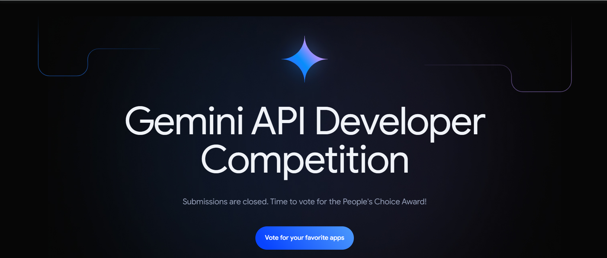

# Awesome Gemini Apps

## What is this repository?

This repository features a curated collection of nearly all the projects submitted to the Google Gemini API competition. Each project entry includes:

- **Project Name**
- **Subtitle** (brief description)
- **YouTube Link** (demo video, if available)
- **What it Does** (detailed description of the project)
- **Built By** (developer or team name)
- **Location** (where the developer/team is from)
- **Project Link** (original project submission link)

Explore these inspiring projects and discover the full potential of the Google Gemini API.
